# Csharp_Notes

[TOC]

## 其它

`main()` - 程序的入口点(entry point)。就算一个程序有多个命名空间，也只能有一个入口点。

`Application.DoEvents()` ：处理当前在消息队列中的所有 Windows 消息。用于告诉程序暂停当前任务，并处理队列中的消息，然后再回到当前任务。

`Thread.Sleep()` 

System.Windows.Forms.Keys : 指定键盘代码和修饰符

**CLR** - 通用语言运行时库(Common Language Runtime)。程序在 CLR 内运行，CLR 是位于系统和程序间的虚拟机。虚拟机可以将运行程序与操作系统的其余部分相隔离。

`return` - 对于没有返回值的方法，可以使用 `return ;` 退出该方法。

`Math` 中拥有众多与数学相关的内容，如`Math.Max()` /  `Math.PI` / `Math.Abs()` 

null - 如果将“引用变量”设为 null，则说明该引用变量不指向任何对象。如果某个对象仅有一个引用变量，并将此引用变量设置为 null，那么便会将该对象标志为可以回收。

私有字段：静态方法可以访问私有字段。

封装：将某些数据设置为私有并编写代码来使用这个数据，便是封装。实现类封装时的提示：考虑字段可能以何种方式被滥用；设置字段时，是否有其它成员会依赖该字段；哪些字段需要在设置时做一些处理或计算；只将必要的字段和方法声明为公共。属性可使字段的封装更加容易。在构造函数中可以初始化私有字段。封装是指创建一个对象，它使用私有字段在内部记录状态，另外使用公共属性和方法，使得其他只能能使用它们需要看到的那部分内部数据。

多态：将一个类的实例用在需要其他类型(如父类或该类实现的接口)的语句或方法中。

`Environment.NewLine`-  获取系统环境定义的换行字符串。 对于非 Unix 平台为包含“\r\n”的字符串，对于 Unix 平台则为包含“\n”的字符串。

日期转换： `Convert.ToDateTime()` ，将以字符串保存的日期转换为 DateTime 类型。

`System.Environment.Exit(1);` - 退出程序并返回错误代码，编写命令脚本和批文件时很有用

`Application.Exit();`  通知所有消息泵必须终止，并且在处理了消息以后关闭所有应用程序窗口。

### Console

Error不会被重定向到out.txt，依然输出到控制台

```c#
Console.SetOut(new StreamWriter("out.txt"));
Console.WriteLine("hello");
// Error不会被重定向到out.txt，依然输出到控制台
Console.Error.WriteLine("kiki");
Console.Out.Close();
```

### 方法

#### ToString 

`ToString` 方法默认返回类名，如 `MyProject.Duck`。该方法是继承自 Object 的虚方法，连接字符串的 `+` 操作符会自动调用对象的 `ToString` 方法，另外 `Console.WriteLine` 和 `String.Format` 也会在传入对象时自动调用这个方法。

格式化字符串：如果向 `ToString()` 传入 `"c"` ，字符串会被转换为一个当地的货币值。`"t3"` 表示转换为有 3 位小数的小数值；`"0"` 表示转换为一个整数；`")%"` 表示转换为一个整数百分数；`"n"` 会显示千位分隔符。

### 字符串

`String.Format("{0:x2}", j)` 格式化字符串

通过 `string` 的构造函数，可将 `char` 数字直接转换为字符串。

字符串实例的 `Substring` 方法可以提取字符串的一部分

将指定字节数组中的所有字节解码为一个字符串：`string GetString(byte[] bytes)` 

### 枚举

《C# 图解教程》中只展示了从 显式值 获取 底层值的情况，其实还可以从底层值获取显式值。

```c#
enum MyEnum {
    Green,
    Yellow,
    Red,
}
private void button3_Click(object sender, EventArgs e) {
    var aa = (MyEnum)1; // 从底层值获取显式值
    MessageBox.Show(aa.ToString());
}
```

Enum.Parse() 可以把字符串解析为相应的枚举值。

### 属性

属性的访问器 `set` 和 `get` 也可设置访问等级。

```c#
public int MyProperty { get; private set; } // 对外部而言，是只读属性
```

`value` 不一定必须要赋值给某个变量，可直接对其进行处理或计算。

```C#
public int MyProperty { set{
    if(value == "hello"){ // do something
    }
} } // 对外部而言，是只读属性
```

可以在构造函数中为没有 `set` 访问器的只读属性赋值，但在其它位置则不行

```c#
class MyClass {
        public MyClass(string test) {
            Test = test;
        }
        public string Test { get; }
    }
```


### 继承

虚方法(virtual) - .NET 使用虚方法表 (virtual method table - vtable) 来跟踪继承了哪些方法，和覆盖了哪些方法。子类隐藏方法时，子类会“重新声明”基类的同名方法。所以在隐藏某个方法后，子类中实际上有两个同名的不同方法：一个从其基类继承，另一个是在子类中“重新声明”的方法。另外，注意下面这个示例的输出结果：

```c#
class Program {
    static void Main(string[] args) {
        BB bb = new BB();
        bb.Method1();
        Console.ReadKey();// 输出“class A”
    }
}
class AA {
    public void Method1() {
        Method2();
    }
    public void Method2() {
        Console.WriteLine("class A");
    }
}
class BB:AA {
    public new void Method2() {
        Console.WriteLine("class B");
    }
}
```

如果通过子类"引用变量"调用继承自基类的方法，那么在该方法中也仅能看到基类中的方法。如果使用虚方法，便可改变这种情况。

如果子类覆盖了基类中的方法或属性，可以使用 `base` 关键字访问基类的成员。

如果基类有构造函数，子类也需要有构造函数。子类构造函数与基类构造函数可以有不同的参数。

virtual 和 override 也适用于属性。

### 接口

实现接口的方法可以在类中直接编写，也可以从一个基类继承。只要编译代码时类中有接口所要求的方法和属性，接口并不关心这些方法或属性是如何的来的。

公共接口中的所有方法都会自动成为公共方法，因为接口就是用来定义实现该接口的类应该具有的公共方法和属性。

接口并不能用来避免创建额外的类或者避免重复代码。接口的目的是让一个类可以完成多个任务，而不依赖于继承，因为继承会带来很多额外的负担，你必须继承每一个方法、属性和字段，而不只是与处理特定任务有关的成员。利用接口，可以按照类完成的工作对其分组，而不必按照继承关系进行分组。接口可以帮助我们确保完成某个工作的各个类在使用同样的方法。

在实现接口中的属性时，并非只能使用自动属性。如果接口中的属性只拥有 get 方法，在实现接口时，任然可以添加 set 方法。


### 命名规则

- 私有字段采用 `camelCase` 风格。

- 公共属性和方法采用 `PascalCase` 风格。

- 方法参数采用 `camelCase` 风格

- 对于某些方法，特别是构造函数，参数与相应字段同名。此时参数将屏蔽字段，字段需表示为 `this.字段名` 。

- 事件中订阅者的事件处理方法命名，`发布者实例名_事件名`

  ```c#
  // 在Form类中为名button1的按钮实例的Click事件创建一个事件处理程序
  private void button1_Click(object sender, EventArgs e) {
  // --snip--
  }
  ```

- 触发事件的方法 `On事件名称` ，下面是触发按钮点击事件的方法

  ```c#
  protected virtual void OnClick(EventArgs e);
  ```


### 转换

`is` 指出一个对象实现了什么

`as` 告诉编译器如何看待一个对象

### 数组

注意静态方法的使用

`Array.Resize` 将一维数组的元素数更改为指定的新大小。

### 集合

collection

任何实现了 IEnumerable 接口的对象都可以创建 List、Queue、Stack，只需要使用指定的重载构造函数，并把集合作为参数传入即可，便会在堆上创建相应的新对象。也就是说 List、Queue、Stack 是可以相互转换的。

```c#
Stack<int> myStack = new Stack<int>();
myStack.Push(1); 
myStack.Push(2); 
myStack.Push(3);
Queue<int> myQueue = new Queue<int>(myStack);
List<int> myList = new List<int>(myQueue);
Stack<int> anotherStack = new Stack<int>(myList);
```


#### List 

List - List 或动态调整所需大小。`IndexOf`；`Contains` ； `ToArray` 将列表转换为数组；`List<T>` 的某个重载构造函数可将数组装换为列表。

排序 ：`Sort` 方法依靠 `IComparer<T>` 接口进行排序。如果被排序的对象没有实现 `IComparable` 接口，也可以向 `Sort()` 传入实现了 `IComparer<T>` 的一个类的实例，以便进行排序。

```c#
public class Duck : IComparable<Duck> { // 在内部实现IComparable接口，用于排序
    public int Size;
    public KindOfDuck Kind;
    public Duck(KindOfDuck kind, int size) {
        Kind = kind;
        Size = size;
    }
    public int CompareTo(Duck other) {//按size从大到小排序
        if (Size > other.Size) return 1;// 正数表明this在other前
        if (Size < other.Size) return -1;// 负数表明this在other后
        return 0;
    }
}

enum SortCriteria { // 用于确定排序方式
    SizeThenKind,
    KindThenSize,
}
class DuckComparer : IComparer<Duck> { // 利用IComparer可以实现更加复杂的比较
    public SortCriteria sortBy = SortCriteria.SizeThenKind;
    public int Compare(Duck x, Duck y) { //按size从小到大排序
        if (sortBy == SortCriteria.SizeThenKind) {
            if (x.Size > y.Size) return 1; //正数表示y在x前
            else if (x.Size < y.Size) return -1;//负数表示x在y前
            else {
                if (x.Kind > y.Kind) return 1;
                else if (x.Kind < y.Kind) return -1;
                else return 0;
            }
        }
        else {
            if (x.Kind > y.Kind) return 1;
            else if (x.Kind < y.Kind) return -1;
            else {
                if (x.Size > y.Size) return 1; //正数表示y在x前
                else if (x.Size < y.Size) return -1;//负数表示x在y前
                else return 0;
            }
        }
    }
}

public enum KindOfDuck {
    Mallard,
    Muscovy,
    Decoy
}
public class RunDuck {
    List<Duck> ducks = new List<Duck>() {
        new Duck(KindOfDuck.Mallard,17),
        new Duck(KindOfDuck.Muscovy,18),
        new Duck(KindOfDuck.Decoy,14),
    };

    public RunDuck() {
        ducks.Sort();// 利用IComparable排序
        DuckComparer duckComparer = new DuckComparer();
        ducks.Sort(duckComparer); // 利用IComparer排序
        foreach (var item in ducks) {
            Console.WriteLine(item.Size);
        }
    }
}
```

#### ArrayList

ArrayList - 非泛型列表，可以存储任何类型的对象，位于 `using System.Collections;`

#### 枚举器

```c#
 public class RunDuck {
        List<Duck> ducks = new List<Duck>() {
            new Duck(KindOfDuck.Mallard,17),
            new Duck(KindOfDuck.Muscovy,18),
            new Duck(KindOfDuck.Decoy,14),
        }; 

        public RunDuck() {
            foreach (var duck in ducks) {
                Console.WriteLine(duck.Size);
            }
            // 上面的forearch和下面的语句等效，与C#图解教程的区别在于，
            // 这里还展示了IDisposable的使用
            IEnumerator<Duck> enumerator = ducks.GetEnumerator();
            while (enumerator.MoveNext()) {
                Duck duck = enumerator.Current;
                Console.WriteLine(duck);//会自动调用duck.ToString()
            }
            IDisposable disposable = enumerator as IDisposable;
            if (disposable != null) disposable.Dispose();
        }
    }
```

#### 字典

`Dictionary<TKey, TValue>` 

```c#
Dictionary<string, string> word =
    new Dictionary<string, string> {
    { "Apple", "苹果" }
};
    word.Add("Pear", "梨子"); // 添加键值对
    // word.ContainsKey("Apple") 测试是否包含某个键
    // word.Remove("Apple");// 删除某个jian'zhi键值对
    // word["Apple"] 通过键获取值，如果键不存在，则会抛出异常
    // word.Keys 获取键列表
    // word.Count 返回字典中键值对的数目
```

#### 队列

Queue 先进先出，实现了 IEnumerable 可使用 foreach 循环。

```c#
Queue<int> myQueue = new Queue<int>();
myQueue.Enqueue(1); // 入队 enqueue
myQueue.Enqueue(2); // 入队 enqueue
myQueue.Enqueue(3); // 入队 enqueue
myQueue.Enqueue(4); // 入队 enqueue
int tackALook = myQueue.Peek();// 查看队列中的第一项，但不删除
int getFirst = myQueue.Dequeue();// 出队 dequeue
int getNext = myQueue.Dequeue();// 出队 dequeue
int howMany = myQueue.Count();
myQueue.Clear();// 清空队列
```

#### 栈

stack 先进后出，实现了 IEnumerable 可使用 foreach 循环。

```c#
Stack<int> myStack = new Stack<int>();
myStack.Push(1); // 压入 push
myStack.Push(2); // 压入 push
myStack.Push(3); // 压入 push
int tackALook = myStack.Peek();// 查看栈中最后一项，但不弹出
int getFirst = myStack.Pop();// 弹出 pop 3
int getNext = myStack.Pop();// 弹出 pop 2
int howMany = myStack.Count();
myStack.Clear();// 清空队列
```


### 泛型

#### 协变

```c#
/* public interface IEnumerable<out T> : IEnumerable {
*  IEnumerator<T> GetEnumerator();}
*  IEnumerable<out T>表明类型参数T的协变
*  
* public interface IEnumerator<out T> : IDisposable, IEnumerator {
*  T Current { get; }
*  IEnumerator<out T>也表明类型参数T的协变
*  
*  虽然这里有两个嵌套的接口类型，但两个接口的参数T都支持协变，
*  所以IEnumerable<T>类型的对象也支持协变：
*  IEnumerable<BaseClass> baseClass = IEnumerable<ChildClass>,
*  虽然 IEnumerable<BaseClass> 和 IEnumerable<ChildClass> 并无继承关系，
*  但是只要 BaseClass 和 ChildClass 之间存在继承关系，便可实现协变，
*  即将由子类构成的可枚举对象赋值给父类的可枚举对象：
*  IEnumerable<BaseClass> baseClass = IEnumerable<ChildClass>,
*/

// List<Duck> ducks = new List<Duck>(){ --snip-- }
// Bird是Duck的父类
IEnumerable<Duck> ducksEnumerable = ducks;
IEnumerable<Bird> upcastDucks = ducksEnumerable;
List<Bird> birds = new List<Bird>();

// 注意List本身并没有实现协变，而是利用IEnumerable接口实现的协变
// birds.AddRange(IEnumerable<out T>)
birds.AddRange(ducksEnumerable);

// Add方法是在添加某只鸟，而非是IEnumerable类型的一堆鸟
birds.Add(new Duck(KindOfDuck.Mallard, 17));
```

### 读写文件

.NET Framework 程序使用流(stream)读写数据。Stream 是所有流的抽象基类，流是字节序列的抽象概念，如文件、输入输出设备、内部进程通信管道或 TCP/IP 套接字。以下类均继承自 Stream：

- FileStream 允许读写文件
- MemoryStream 允许向内存块读写数据
- NetworkStream 对象允许向网络上的其它计算机或设备读写数据
- GZipStream 允许压缩数据

流的基本工作：

- Write() 将数据写至流
- Read() 从流中读取数据
- Seek() 改变在流中的位置，查找流中的某个位置，以便在特定位置插入数据

数据在到达最终目的地之前可以经过多个流。比如可以先使用 CryptoStream 流对数据加密，再将加密后的数据传递给 FileStream 流。

#### FileStream

`System.IO` 命名空间中包含了用于读写文件和数据流的各种类型，因此在使用流时，需要添加此命名空间。

FileStream 类用于向二进制文件读写字节，其读写方法处理的是字节和字节数组。而 StreamReader 和 StreamWriter 的方法专用于读写文本。

使用 FileStream 向文件读写字节

- 创建一个新的FileStream对象，通知它写文件
- FileStream 将自己关联到一个文件，一次只能关联一个文件
- 将字符串转换为 byte 数组，将被写数据编码encoding为byte数组
- 调用流的 Write() 方法，并传入byte数组
- 关闭文件。如果文件没有关闭，文件会被锁定，其它程序无法访问该文件。

```c#
// 用FileStream类直接创建流
FileStream fileStream = new FileStream("binaryData.dat", FileMode.Append);
```

Length 属性用于获取用字节表示的流长度。


#### StreamWriter 

`System.IO`

使用 StreamWriter 向文件写入文本，StreamWriter 会自动创建并管理 FileStream 对象，比直接使用 FileStream 对讲更加简单。

StreamWriter (继承自 TextReader)是一个从流读取字符的类，它本身并不是一个流。将文件名传入 StreamWriter 类的构造函数时，StreamWriter 对象会为我们创建一个流，当我们在 StreamWriter 对象上调用 `Close()` 方法时，它会关闭之前创建的流。StreamWriter 的一个构造函数可将 Stream 作为参数。

```C#
private void button1_Click(object sender, EventArgs e) {
    // StreamWriter会自动创建并管理FileStream对象，
    // 因此在StreamWriter对象和文件之间，还有一个FileStream对象
    // StreamWriter构造函数会打开或创建一个文件，
    // append: false 会直接覆盖文件
    StreamWriter writer = new StreamWriter("Test2.txt", append: true);
    writer.Write("写文本，不换行。");
    writer.WriteLine("写文本，并换行");
    writer.WriteLine("格式化字符串 {0} 和 {1}。", "A", "B");
    // 释放该文件的所有连接，以及StreamWriter使用的所有资源。
    // 如果没有关闭流，文本就不会写入文件，同时还会锁定该文件,
    // 导致其它程序也无法使用该文件。
    writer.Close();
}
```

#### StreamReader

```c#
private void button5_Click(object sender, EventArgs e) {
    StreamReader reader = new StreamReader("button1_Click.txt");
    Console.WriteLine(reader.Read());// 读取一个字符
    while (reader.EndOfStream) { // EndOfStreams表明文件中是否还有未读的数据
        Console.WriteLine(reader.ReadLine());// 读取一行字符串
    }
    reader.Close();
}
```

- `ReadBlock` 从当前文本读取器中读取指定的最大字符数并从指定索引处开始将该数据写入缓冲区。调用该方法时会阻塞，要等到该方法执行完毕才会返回。
  `int ReadBlock(char[] buffer, int index, int count);` 

如果用 `File.WriteAllBytes()` 将一个字节数组（包含大于127的值）写至一个文件，如果使用 StreamReader 实例的 逐一读取每个字节，会发现如果字节值大于 127 ，那么通过 StreamReader 实例读入的值会变为 fffd，这是因为 StreamReader 只能用来读取文本文件，其中只能包含小于 128 的字节。

#### File

`System.IO`

File 是一个静态类，所以它只是一组可以用来处理文件的方法。这些方法会自动打开一个文件、读写数据，然后自动将文件关闭。

类似于 StreamWriter ，File 类也会创建流，以便在后台处理文件。可以使用这个类的方法完成大多数常见的操作，而不需要先创建 FileStream。

File 的功能：

- 查找文件是否存在，`Exists()` 用于检查一个文件是否存在。
- 读写文件，`OpenRead()` 用于从文件获取数据，`Creat()` 或 `OpenWrite()` 用于写文件，`Open()` 打开文件。 `OpenWrite()` 只是从开始处覆盖原来的数据。
- 向文件追加文本，`AppendAllText()` 用于向一个已创建的文件追加文本。如果文件不存在，则会创建该文件。
- 获取文件信息，`GetLastAccessTime()`  和 `GetLastWriteTime()` 返回最后一次访问和修改文件的日期和时间。

```c#
private void button11_Click(object sender, EventArgs e) {
    File.WriteAllText(@"./weirdo.txt",
                      @"第一行
第二行");
    File.ReadAllText(@"./weirdo.txt");
    // 加密文件，家庭版的系统不支持
    // File.Encrypt(@"./weirdo.txt"); 

    File.Copy(@"./weirdo.txt", @"./copy.txt");
    File.SetLastWriteTime(@"./copy.txt", dateTime);
    File.Delete(@"././copy.txt");

}
```

读写byte数组，并改变字节数组中的数据

```c#
private void button20_Click(object sender, EventArgs e) {
    File.WriteAllText("hello.txt", "hello");
    byte[] greeting = File.ReadAllBytes("hello.txt");
    //greeting.Reverse(); // 返回一个反转后的byte数组的引用，不修改原数组
    Array.Reverse(greeting);
    File.WriteAllBytes("hello.txt", greeting);
}
```

读写 string 数组 `ReadAllLines()` 、`WriteAllLines` 

#### FileInfo

如果希望对文件做很多操作，就需要创建 FileIndo 类的实例，而不是继续使用 `File` 类的静态方法。唯一的区别是，File 类完成少量操作时速度更快，而 FileInfo 更适合完成大量操作。

File 是一个静态类，所以它只是一组可以用来处理文件的方法。FileInfo 是一个可以实例化的对象，要求必须用一个文件名来实例化对象，其方法与 File 中的方法完全相同。如果只需要完成一个文件操作，比如只是删除或移动一个文件，使用 File 较为方便。如果需要对同一个文件完成多个操作，则使用 FileInfo 比较方便，因为只需传递一次文件名。

File 类能做的所有工作 FileInfo 类都能完成，只不过 FileInfo 类必须先实例化才能使用。在创建 FileInfo 的实例后，同样可以使用 `Exists()` 或 `OpenRead()` 方法。

#### Directory

`System.IO`

利用 Directory 对象，可以处理包含文件的整个目录，Directory 是一个静态类。

Directory 的功能：

- 创建一个新目录，`CreateDirectory()` 方法用于创建一个新目录。只需提供路径即可。
- 获得目录中的文件列表，`GetFile()` 方法用于获取指定目录下的文件列表。
- 删除目录，`Delete()` 。

```c#
private void button11_Click(object sender, EventArgs e) {
    if (!Directory.Exists(@"./Hello")) { // 是否包含指定文件
        Directory.CreateDirectory(@"./Hello");
        Directory.CreateDirectory(@"./Delete");
        Directory.Delete(@"./Delete");
    }
    // 设置文件的创建时间
    Directory.SetCreationTime(@"./Hello", new DateTime(2000, 09, 25));
    // 获取指定目录的文件列表
    var files = Directory.GetFiles(@"./", "*.txt", SearchOption.AllDirectories);
    foreach (var file in files) {
        Console.WriteLine(file);
    }
    // 获取文件夹的创建时间
    DateTime dateTime = Directory.GetCreationTime(@"./Hello");


    File.WriteAllText(@"./weirdo.txt",
                      @"第一行
第二行");
    File.ReadAllText(@"./weirdo.txt");
    // 加密文件，家庭版的系统不支持
    // File.Encrypt(@"./weirdo.txt"); 

    File.Copy(@"./weirdo.txt", @"./copy.txt");
    File.SetLastWriteTime(@"./copy.txt", dateTime);
    File.Delete(@"././copy.txt");

}
```

#### BinaryWriter 和 BinaryReader

将 string、char、int、float 写入文件前都可以先编码为字节数组，但是这个过程很繁琐。因此，.NET 提供了 BinaryWriter 类，该类会自动对数据进行编码，并写至一个文件。注意，StreamWriter 也会对数据编码，但它专门用于文本和文本编码。

创建 FileStrem 流，并传入 BinaryWriter 构造函数，然后调用 BinaryWriter 的方法来写数据。

```c#
private void button21_Click(object sender, EventArgs e) {
    int intValue = 48769414;
    string stringValue = "Hello!";
    byte[] byteArray = { 47, 129, 0, 116 };
    float floatValue = 491.695F;
    char charValue = 'E';
    // 创建 FileStrem 流，并传入 BinaryWriter 构造函数
    // 该BinaryWriter构造函数使用 UTF-8 编码
    using (BinaryWriter writer = new BinaryWriter(File.Create("binaryData.dat"))) {
        writer.Write(intValue);// 自动完成编码，然后发送给流对象
        writer.Write(stringValue);
        writer.Write(byteArray);
        writer.Write(floatValue);
        writer.Write(charValue);

    }
    byte[] dataWritten = File.ReadAllBytes("binaryData.dat");
    foreach (var b in dataWritten)
        Console.Write("{0:x2} ", b);
    Console.WriteLine(" - {0} bytes", dataWritten.Length);
    // 输出:86 29 e8 02 06 48 65 6c 6c 6f 21 2f 81 00 74 f6 d8 f5 43 45  - 20 bytes

    // 使用BiReader读回数据
    using (BinaryReader reader = new BinaryReader(File.OpenRead("binaryData.dat"))) {
        // reader并不知道流中具体的数据类型，所以需要使用恰当的方法
        int intRead = reader.ReadInt32();
        string stringRead = reader.ReadString();
        byte[] byteArrayRead = reader.ReadBytes(4);
        float floatRead = reader.ReadSingle();
        char charRead = reader.ReadChar();
    }
}
```


### IDisposable 接口

很多 .NET 类都实现了 IDisposable 接口，该接口只有一个成员：Dispose() 方法。Dispose() 用于告诉对象释放为它分配的资源。很多类会分配重要的资源，如内存、文件和其它对象。这说明类会把这些资源拿走，在你告诉它已经用完这些资源之前是不会归还的。对于任何实现了 IDisposable 接口的类，只要调用了它的 Dispose() 方法，就会立即释放其所占用的资源，这往往是结束对象处理的最后一步。IDisposable 可用于任何类，不限于文件和流。

实现 IDispose 的一个原则是 Dispose() 方法可以多次被调用，并且没有任何副作用。

下面这个示例，会在 `Dispose()` 方法中编写清理代码（适用于需要执行清理工作的定制对象），并在 using 语句中使用该对象：

```c#
class Sum:IDisposable {
    public int value;
    public Sum(int value) {
        this.value = value;
    }

    public void Dispose() {
        value = 0;
        Console.WriteLine("清零");
    }
}
// --snip--
private void button6_Click(object sender, EventArgs e) {
    using (Sum sum = new Sum(10)) {
        sum.value = 100;
    }
}
```

###  Using

在一个 `using` 块中声明一个对象，这个对象的 Dispose() 方法会自动调用。
并且只有实现 `IDisposable` 的对象才能用于 `using` 。

比如，将使用流的代码包围在一个using语句中时，在离开 using 时便会自动关闭流。

```c#
private void button14_Click(object sender, EventArgs e) {
    // using语句后面总有一个对象声明，
    // 比如在using语句中声明流引用
    using (StreamWriter sw = new StreamWriter(@"./secret_plain.txt")) {
        sw.WriteLine("向文件写入数据");
    // using结束时，会运行所用对象的 Dispose() 方法，
    // 因此不需要再调用对象的Close()方法了
    // 每个流都有一个 Dispose() 方法，用于关闭流。
    }

    // 多个对象要使用多个using语句
    // 可以在using语句之上再叠加其它using语句，不必另外使用大括号或缩进
    using (StreamReader reader = new StreamReader(@"./secret_plain.txt"))
        using (StreamWriter Writer = new StreamWriter(@"./email.txt")) {
        // 使用 reader 和 Writer
    }

}
```

### 序列化

serialization

序列化一个对象时，会保存该对象的完整状态，因此可以在堆中复活该对象，也就是反序列化。也就是说利用序列化可以读写整个对象。对象所在的命名空间也会被记录到序列化后的文件中。

对象会在字段中存储它的状态，因此序列化一个对象时，所有字段都必须保存到文件中。C# 会从需要序列化的对象开始，逐一检查它的各个字段，以便确定其字段是否引用了其它对象，然后对所有被引用的对象做同样的处理。因此原始对象及其引用的对象，都会被序列化到文件中，同时提供在逆序列化时，C# 重构对象所需的全部信息。

如果在序列化后的文件中，修改某字段的值。那么对该对象反序列化时，便会得到修改后的类。

序列化步骤：

- 在需要串行化的类前，需要增加 `[Serializable]` 特性；
- 创建一个 `BinaryFormatter` 类的实例对象，该类属于
  `using System.Runtime.Serialization.Formatters.Binary;` 命名空间
- 创建一个流，并读写对象

```c#
using System.IO; //
using System.Runtime.Serialization.Formatters.Binary; //

namespace Chapter_9 {
    // 添加序列化特性.
    // 只有当类中包含的字段是值类型(如int/string/enum),
    // 或者是其它可串行化的类时，才能使用[Serializable]特性标志
    // 如果没有向需要串行化的类增加这个属性，或类中某个字段的类型不能序列化，
    // 在运行程序时，便会给出异常。
    [Serializable] 
    public class SomeObj {
        public string str1 = "123";
    }

    class Serial_ {
        public Serial_() {
            var begin = new SomeObj();
            var formatter = new BinaryFormatter();
            // 创建一个流，然后序列化对象
            using (var outputStream = File.Open(typeof(SomeObj).Name + ".dat", FileMode.OpenOrCreate, FileAccess.ReadWrite))
                // 同样可以使用 File.Create 或  File.OpenWrite
                {
                // Serialize可将任何对象序列化到一个流中,
                // Serialize方法获取一个对象，并把它写至一个流
                formatter.Serialize(outputStream, begin);
            }
            // 反序列化
            using (var inputSteam = File.Open(typeof(SomeObj).Name + ".dat", FileMode.Open, FileAccess.Read)) {
                // Deserialize可从流中读回对象
                SomeObj after = (SomeObj)formatter.Deserialize(inputSteam);//需要显式类型转换
            }
        }
    }
}
```

将多个对象序列化到同一个文件中：对目标对象用同一 `BinaryFormatter` 对象逐一序列化即可。从同一个文件中读取多个对象时，每次在调用 `Deserialize()` 方法时，仅会返回一个实例对象，获取多个对象时只需重复调用 `Deserialize()` 即可。

另外，还可将对象序列化为 XML。

### 编码

注意 win 的控制台不是 Unicode，如果直接在 vs 输出窗口中观察 char，便会与 Unicode 字符不符。

.NET 使用 Unicode 格式将字符或串编码为字节。编码(Encoding)是指将逻辑数据(如字母H) 转换为字节(数字72)。字母、数字、枚举和其它数据最后都会以字节形式存储在磁盘或内存中。字符映射表(charmap.exe)可显示字母的编码。

```c#
private void button22_Click(object sender, EventArgs e) {
    string aa = "A";
    char bb = 'B';
    byte aaByte = (byte)aa[0]; // 可将char转换为字节
    byte bbByte = (byte)bb;
    Console.WriteLine(aaByte + " " + bbByte);
}
```

C# 用于存储文本的两个类型 string 和 char，都采用 Unicode 格式在内存中存储数据。数据作为字节写至一个文件时，会按照指定编码写入文件。读写文件的默认编码是 UTF-8，

```c#
 private void button18_Click(object sender, EventArgs e) {
	 // 使用UTF8对字符串编码，并写入文件。UTF8无BOM
     File.WriteAllText(@"Eureka.txt", "Eureka"); 
     // 获取UTF8编码的byte数组
     byte[] eurekaBytes = File.ReadAllBytes("Eureka.txt"); 
     // byte数组的内容：45 75 72 65 6b 61，采用UTF8编码
	
     // 使用UCS对字符串编码，并写入文件
     File.WriteAllText(@"Eureka.txt", "םולש", Encoding.Unicode);
     // 获取UCS编码的byte数组
     eurekaBytes = File.ReadAllBytes("Eureka.txt");
     // byte数组的内容：ff fe 45 00 75 00 72 00 65 00 6b 00 61 00
     // ff fe 表示用两个字节表示一个string字符，采用Unicode编码
     // ff fe 称为“字节顺序标志”，一旦程序看到该标志，
     // 就会明白所有字符编码都会占用两个字节。比如E会编码为0045
 }
```

直接可修改字节编码的内容

```c#
private void button20_Click(object sender, EventArgs e) {
    File.WriteAllText("hello.txt", "hello");
    byte[] greeting = File.ReadAllBytes("hello.txt");
    //greeting.Reverse(); // 返回一个反转后的byte数组的引用，不修改原数组
    Array.Reverse(greeting);
    File.WriteAllBytes("hello.txt", greeting);
}
```

#### Unicode 字节循序标志

采用 Unicode 编码时，由于 Unicode 编码通常是两个字节，因此会使用字节循序标志来表示字节的排序模式：

- `ff fe` 表示 little endian 小端模式
- `fe ff` 表示 Big endian 大端模式

```c#
private void button23_Click(object sender, EventArgs e) {
    string fileName = "./Hello/test.txt";
    File.WriteAllText(fileName, "e"); 
    foreach (var item in File.ReadAllBytes(fileName)) {
        Console.WriteLine("{0:x}",item);
    }
    // utf8编码，没有字节循序标志
    // 输出 65

    File.WriteAllText(fileName, "e", Encoding.Unicode);
    foreach (var item in File.ReadAllBytes(fileName)) {
        Console.Write("{0:x} ", item);
    }
    Console.WriteLine();
    // 输出 ff fe 65 0 
    
    File.WriteAllText(fileName, "e", Encoding.BigEndianUnicode);
    foreach (var item in File.ReadAllBytes(fileName)) {
        Console.Write("{0:x} ", item);
    }
    Console.WriteLine();
    // 输出 fe ff 0 65
}
```

### 查看二进制数据

十六进制转储(hex dump) 格式，查看二进制数据的标准方法。

```c#
// 
// StreamWriter实例只能用来读取文本文件，只能包含小于128的字节，
// 当字节大于等于128时，读取到的值均会被设置为 0xfffd，
// 使用Stream.Read可以纠正这个错误
private void butHexDump_Click(object sender, EventArgs e) {
    using (StreamReader reader = new StreamReader(@"./SomeObj.dat"))
        using (StreamWriter writer = new StreamWriter(@"./Output1.dat", false)) {
        int position = 0;
        while (!reader.EndOfStream) {
            char[] buffer = new char[16];
            // 从流中读取字符
            int charactersRead = reader.ReadBlock(buffer, 0, 16);
            writer.Write("{0}: ", String.Format("{0:x4}", position));
            position += charactersRead;
            for (int i = 0; i < 16; i++) {
                if (i < charactersRead) {
                    string hex = String.Format("{0:x2}", (byte)buffer[i]);
                    writer.Write(hex + " ");
                }
                else {
                    writer.Write("   ");
                }
                if (i == 7) {
                    writer.Write("--");
                }
                // 小于32的为控制字符，不可显示.不理解大于250的原因
                if (buffer[i] < 32 || buffer[i] > 250) {
                    buffer[i] = '.';
                }
            }
            string bufferContents = new string(buffer);
            writer.WriteLine(" " + bufferContents.Substring(0, charactersRead));
        }
    }
}
```

改进后的程序代码如下：

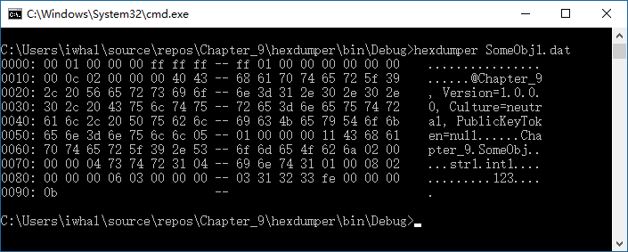

```c#
static void Main(string[] args) {
    if (args.Length != 1) {
        Console.Error.WriteLine("usage: hexdmper file-to-dump");
        System.Environment.Exit(1); //退出程序并返回错误代码，编写命令脚本和批文件时很有用
    }
    if (!File.Exists(args[0])) {
        Console.Error.WriteLine("File does not exist: {0}", args[0]);
        System.Environment.Exit(2);
    }
    using (var input = File.OpenRead(args[0])) {
        int position = 0;
        byte[] buffer = new byte[16];
        while (position < input.Length) {
            // 从流中直接读取字节
            int charactersRead = input.Read(buffer, 0, buffer.Length);
            if (charactersRead > 0) {
                Console.Write("{0}: ", string.Format("{0:x4}", position));
                position += charactersRead;
                for (int i = 0; i < 16; i++) {
                    if (i < charactersRead) {
                        string hex = String.Format("{0:x2}", (byte)buffer[i]);
                        Console.Write(hex + " ");
                    }
                    else {
                        Console.Write("   ");
                    }
                    if (i == 7) {
                        Console.Write("-- ");
                    }
                    if (buffer[i] < 32 || buffer[i] > 250) {
                        buffer[i] = (byte)'.';
                    }
                }
                //文本文件的编码是UTF8
                string bufferContents = Encoding.UTF8.GetString(buffer);//从UTF8编码的缓冲区获取字符串
                Console.WriteLine("   " + bufferContents.Substring(0, charactersRead));
            }
        }
    }
}
```

### 异常

异常也称作“运行时错误”，程序抛出异常时，.NET 会生成一个 Exception 对象。如果异常没有得到处理，程序会停止运行而崩溃。出现未处理异常说明程序会以不可预知的方式运行，正因如此，只要遇到未处理异常，程序就会中止。只有 `try/finally` 块也完全合法，在抛出异常后会立即执行 `finally` 。

- `ToString` 会生成一个总结，其中包含异常字段中的所有信息。
- `Data` 包含与异常有关的重要数据

构造函数中的异常：如果在构造函数中抛出异常，那么试图通过此构造函数实例化这个类的语句不会得到该对象的实例，也就是说该语句中的引用变量不会指向某个实例。因此就算在构造函数内部捕获了异常，但由于引用变量为 null，如果后续代码使用了该引用变量，仍旧会抛出新的异常。所以要在调用该构造函数的语句处添加 try/catch，才能避免这些问题问题。

SerializationException  异常位于 System.Runtime.Serialization;

`catch(Exception)` 和 `catch` 会捕获所有异常。不过代码要捕获尽可能特定的异常。

创建定制异常，并抛出该异常

```c#
class MyException : Exception {
    // 重载构造函数，以便传入异常消息
    public MyException(string message) : base(message) {
    }
}

class MyClass {
    public void ThrowException() { throw new MyException("抛出我的异常"); }
}

// --snip--
private void button4_Click(object sender, EventArgs e) {
    try {
        MyClass myClass = new MyClass();
        myClass.ThrowException();
    }
    catch (MyException ex) {
        MessageBox.Show(ex.Message);
    }
}
// --snip--
```

关于异常处理的建议：

- 设计代码时要妥善地处理失败
- 要为用户提供有用的错误消息
- 尽可能抛出 .NET 内置异常，只有需要提供定制信息时才抛出定制异常
- 要考虑到 `try` 块中的代码可能被短路。
- 避免不必要的文件系统错误，只要使用流就应当使用 using 块

### 事件

回调？

委托和事件的区别：

http://www.cnblogs.com/kissazi2/p/3189685.html
https://www.cnblogs.com/xcl461330197/articles/4524577.html

事件使用委托来通知对象发生了某些动作。如果把一个事件标志为 private，那么

外部类不可直接调用事件，因此需要通过一个方法来从类的内部调用事件，该方法通常为 protected 。比如 Button 控件：

```c#
public class Button : ButtonBase, IButtonControl {
    --snip--
    // 引发 System.Windows.Forms.Control.Click 事件。
    // 参数:
    // e: 包含事件数据的 System.EventArgs。
    protected override void OnClick(EventArgs e);
    --snip--
```

安全调用事件的方法如下：(如果没有为事件添加事件处理方法，则该事件为null。如果事件为 null，则会抛出 NullReferenceException )

```c#
// 方法1
MyEvent?.Invoke();
// 方法2 使用Invoke片段
EventHandler temp = MyEvent;
if (temp != null) {
    temp();
}
```

公共语言运行时`Invoke`为每个委托类型提供一个方法，与委托具有相同的签名。您不必从C＃，Visual Basic或Visual C ++显式调用此方法，因为编译器会自动调用它。当您想要查找委托类型的签名时，该`Invoke`方法在[反射中](https://docs.microsoft.com/zh-cn/dotnet/framework/reflection-and-codedom/reflection?view=netframework-4.7.2)很有用 (来源 [url](https://docs.microsoft.com/zh-cn/dotnet/api/system.delegate?view=netframework-4.7.2))。 

事件处理程序虽然可以有返回值，但是如果事件处理程序不返回 void，就不能把事件处理程序串起来了，也就是说不能向事件上注册多个事件处理程序。

如果向某个事件重复注册同一事件处理器，那么当事件被触发时，该事件处理器也会执行多次。事件不关心同一事件处理器是否重复。

### 委托

委托是指向方法的引用。委托类型也可用于返回值。

回调 callback，回调是使用委托的另一种方式，其关键在于发布者可以控制订阅者。对于public 事件，其它对象可以通过增加事件处理程序来从发布者外部订阅事件。对于回调，只能在发布者内部订阅委托（如果将事件私有化，仅在发布者内部使用，也可建立回调）。
订阅者提供的方法称为回调方法，因为发布者通过执行这些方法来“往回调用订阅者的方法”。

```c#
public delegate void BatCallback(BallEventArgs e);

public class BallEventArgs : EventArgs {
    public int Trajectory { get; private set; } // 球的轨迹
    public int Ditance { get; private set; } // 球飞行距离
    public BallEventArgs(int trajectory, int ditance) {
        Trajectory = trajectory;
        Ditance = ditance;
    }
}

public class Bat { // 击球
    BatCallback hitBallCallback;
    /* 回调就是把订阅者持有的方法传递给发布者，并在发布者内部进行订阅，
        * 同时发布者持有委托或事件需要私有化
        */
    public Bat(BatCallback hitBallCallback) { // 回调
        this.hitBallCallback = hitBallCallback;
    }
    public void HitTheBall(BallEventArgs e) {
        hitBallCallback?.Invoke(e);
    }
}


public class Ball { // 球
    public event EventHandler<BallEventArgs> BallInPlay; // 共击球者订阅的事件
    protected void OnBallInPlay(BallEventArgs e) { // 触发击球事件
        BallInPlay?.Invoke(this, e);
    }
    /* 在订阅者内部实例化发布者，
         * 并将回调方法传递到发布者内部
         */
    public Bat GetNewBat() {
        return new Bat(OnBallInPlay);
    }
}
```


## VS 2017

`.sln` - 解决方案文件，并拥有一个对应的解决方案文件夹。`.sln` 中包含了解决方案文件夹中所有 `.csproj` 文件的一个列表

`.csproj` - 工程文件，包含了与该工程相关的所有其他文件的一个列表。

**.NET Framwork** - C# 只是一种语言，而 .NET Framwork 为我们提供了各种各样的工具，并把这些工具划分到不同的命名空间中（各种控件都属于 .NET Framwork 的组成部分，将窗体关联到数据库的内部代码也属于 .NET Framwork）。我们通过编程语言来使用 .NET Framwork 中的各种工具，因此 C# 和 .NET Framwork 的关系类似于语法与词汇的关系。

**编译程序** - 通过编译器(compiler)将程序的源代码转换为一个可执行文件(executable)。编译后的文件存放在 bin 文件夹中。

**命令行参数** - 程序入口点方法声明为 `static void Main(string[] args)` ，如果在运行程序时提供了命令行参数，args 参数会包含这些命令行参数。另外，winForms 引用同样可以使用命令行参数。在 IDE 中通过工程下的 Properties 下的 Debug 标签中可设置命令行参数。

### 解决方案资源管理器

在 Solution Explorer 中会显示工程的所有内容

```
解决方案
	|- 项目名
		|- Properties
		|- 引用
		|- App.config
		|- Form1.cs // 包含定义窗体行为的C#代码
			|- Form1.Designer.cs // 包含定义窗体及其对象的代码
				|- Form1 // 窗体类的名称
			|- Form1.resx // 包含与Form1关联的所有资源
		|- Program.cs // 包含启动程序和显示窗体的代码
```

由上可见，默认窗体名为 Form1，相应的文件名为 Form1.cs、Form1.Designer.cs 和 Form1.resx，并且在资源管理器中可以直接修改这些文件的名称。默认情况下，文件名与窗体类名相同。窗体类的名称，可以通过窗体 > 属性 > Name 修改，但上述文件名不会随类名的变化而变化，反之亦然。

每当在增删控件或修改控件属性时，IDE 便会自定调整 Form1.Designer.cs 中相应的代码。

#### 资源

资源(resource)：指可以打包到应用程序中的其他数据类型的文件，如图形文件、音频文件、图标等。被添加的资源会集成到程序中，在另一台计算机中安装程序时，资源文件也会随之安装。

添加资源：在“选择资源”对话框中，通过“本地资源”导入的文件，会被添加到相应窗体的 `.resx` 文件中，该文件包含了与窗体关联的所有资源；通过“项目资源文件”导入的文件，可在 Properties 下的 `.resx` 文件进行管理，资源文件会存放在 Resources 文件夹中。

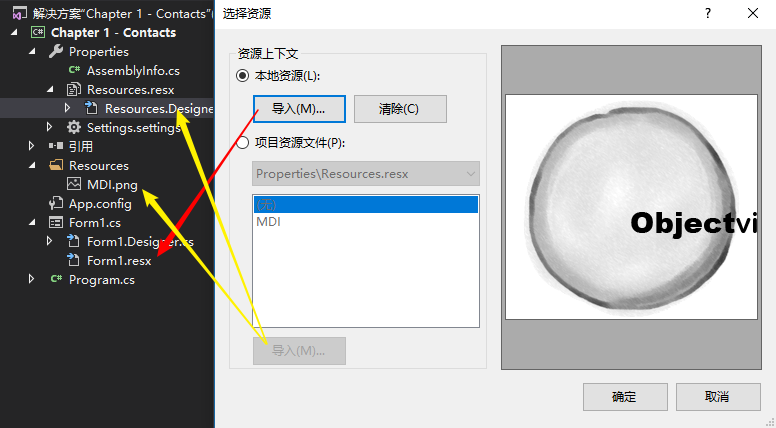


### 属性窗口

“属性窗口”用于实现对 `FormXx.Designer.cs` 中的特定代码进行自动编辑。如果在“属性窗口”对属性进行了调整，那么 `FormXx.Designer.cs` 中的代码便会出现相应的变化。

快捷属性菜单：用于访问常用属性，如下图：

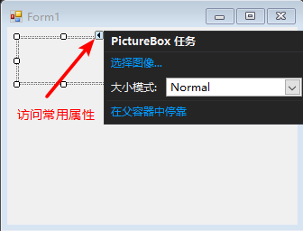


### 数据库操作

[Create a database](https://docs.microsoft.com/en-us/visualstudio/data-tools/create-a-sql-database-by-using-a-designer) 

[演练：在 Visual Studio 中创建本地数据库文件](https://msdn.microsoft.com/zh-cn/library/ms233763?f=255&MSPPError=-2147217396) 

笔记：添加数据库、修改数据库中的表明、在数据源中添加数据库中的表

### 发布程序

通过发布指定的项目，便可以创建部署包。利用部署包便可在别的计算机上完成程序的安装。

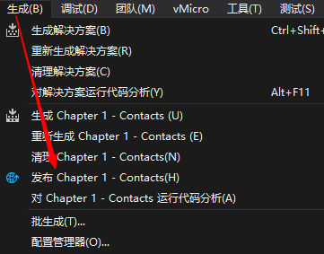

生成的部署包如下：

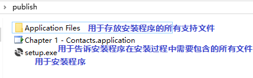

### 控件

添加控件时，会在 FormName.Designer.cs 中生成对应控件的代码。

用于触发控件的事件的方法可以被覆写：

```c#
// 因为在类的外部不能直接调用事件，所以只能通过一个方法从外部触发事件
// 下面是触发 System.Windows.Forms.Control.DoubleClick 事件的方法。
protected override void OnDoubleClick(EventArgs e) {
	MessageBox.Show("Test");
	base.OnDoubleClick(e);
}
```

#### 对话框

非可视化控件。

调用 ` DialogResult ShowDialog()` 方法会显示对话框，返回值是 ` DialogResult ` 枚举类型。

```c#
public enum DialogResult {
    None = 0,
    OK = 1,
    Cancel = 2,
    Abort = 3,
    Retry = 4,
    Ignore = 5,
    Yes = 6,
    No = 7 }
```

FolderBrowserDialog 文件夹浏览器对话框

openFileDialog 打开文件对话框

SaveFileDialog 另存为对话框

```c#
// 保存textBox1中的文本到指定文件
private void button13_Click(object sender, EventArgs e) {
    if (saveFileDialog1.ShowDialog()== DialogResult.OK) {
        name = saveFileDialog1.FileName;
        File.WriteAllText(name, textBox1.Text);
    }
}
// 将指定文件中的文本读取到textBox1中
string name;
private void button12_Click(object sender, EventArgs e) {
    if (openFileDialog1.ShowDialog() == DialogResult.OK) {
        name = openFileDialog1.FileName;
        textBox1.Clear();
        textBox1.Text = File.ReadAllText(name);
    }
}
```

##### 属性

- `Title` 标题栏中的文本
- `FileName` 在对话框中默认显示的文件名，选中某个文件后，该属性会发生改变。从对话框返回后，可通过该属性得知选中的文件名。
- `Filter = "文本文件(*.txt)|*.txt|所有文件(*.*)|*.*";`   文件过滤器
- `InitialDirectory`  对话框初始文件路径

### 容器

#### 布局器

利用布局器可以让控件合理排布。

TableLayoutPanel：表格布局。如果需要让控件在布局器中居中，需要调整控件自身的 `Anchor` 属性。

- Rows 属性，控制布局器的列和行

FlowLayoutPanel1：流布局，控件顺序摆放

- FlowDirection：指定控件布局的方向

### 属性

Visible，对于窗体和控件均可用。

```c#
// 获取或设置一个值，该值指示是否显示该控件及其所有子控件。
// 返回结果:
// 如果显示该控件及其所有子控件，则为 true；否则为 false。 默认值为 
public bool Visible { get; set; }
```

numericUpDown 控件的 Value 属性是 decimal 类型。

#### Form

FormBorderStyle - 窗体大小是否可调整。

#### ListBox

MultiColumn - 是否在列中水平显示 Items 中的元素。

Multiline - 是否在控件中显示多行文本

Items.SelectedIndex - 如果未选定任何项，则返回值为负一 (-1)，Items 为空也返回 -1。

#### ComboBox

设置默认值 - `combobox1.Text="默认值"; `或 `comboBox1.SelectedIndex = 默认值的索引;`

#### StatusStrip

SizingGrip - 状态条中是否包含调整窗体大小的手柄。

##### ToolStripStatusLabel

Spring - 是否填充状态条的剩余空间。

#### 

### 调试

**调试** - IDE 会编译程序，并运行可执行文件，同时能够中断程序的运行，以便了解程序的执行情况。

开始执行(不调试) - ctrl + F5 ，IDE 将不再调试模式运行程序，断点和监视项都不起作用，程序完成时，会输出 `Press any key to continue...`  

#### 断点调试

创建断点（直接双击红点处，可直接创建断点；还可以选择 调试 > 切换断点 F9）：

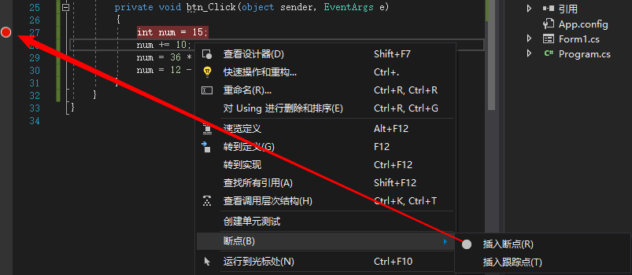

开始 Debug 后，操作程序进入断点所在代码段，便可触发断点。

#### 监视窗口

一旦触发断点，IDE 便会用黄色突出显示断点代码行。此时可为断点处的变量添加“监视”窗口（如下图），以便观察变量的相关信息。接下来可单步跟踪（F10 逐过程）代码的执行，同时在“监视”窗口中可观察到值的变化。

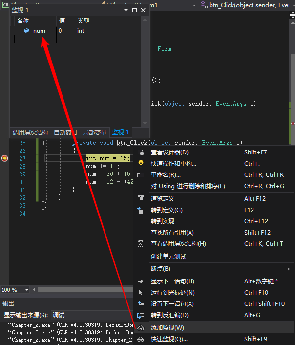

在 监视窗口 中可修改所显示的变量和字段的值，甚至可以执行方法和创建对象。如果在 监视窗口 中进行了这些操作，那么相关对象会显示重计算图标。利用这一点甚至可以生成异常：

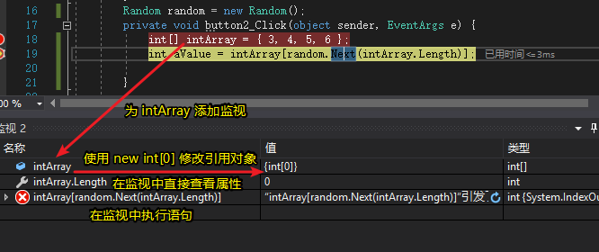

可见上述代码通过修改 监视窗口 中的参数，生成了异常。程序中任何合法的语句都可以在 监视窗口 中运行，即便是像 `System.Threading.Thread.Sleep(2222)` 这样的语句也能够执行。

监视窗口 中执行的所有修改只会影响内存中的数据，而且只持续到程序运行结束。重启程序后， 监视窗口 中修改的值会被还原。

#### 调试信息

IDE 的调试工具会调用对象的 `ToString` 方法，来显示对象的相关信息。

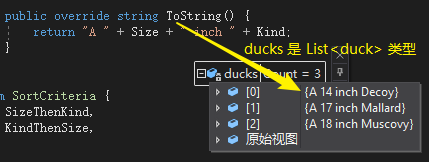

注意：在调试过程中通过鼠标悬停的方式查看某属性值时，实际上会调用该属性的 get 方法。也就是说会执行该属性 get 方法中的所有语句。

#### 调试工具栏

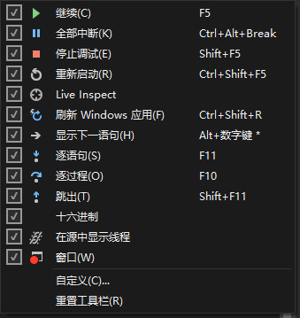

- 逐语句 Step into - 执行下一条语句。如果这是一个方法，则执行这个方法中的第一条语句
- 逐过程 Step over - 执行下一条语句。如果这是一个方法，将作为单个语句来执行
- 跳出 Step out - 运行当前方法中的其余语句，完成后中断
- 十六进制 - 切换到十六进制，默认使用十进制

#### 调试窗口

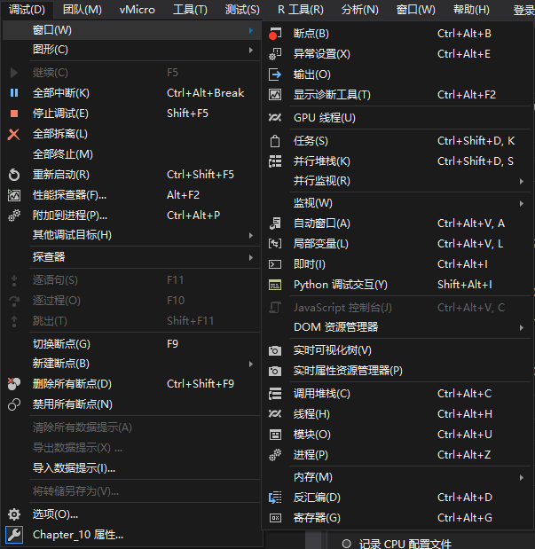

- 局部变量：显示当前内存中的所有局部变量的值

### IntelliSense

智能提示

#### **片段**

snippets，在 IDE 中输入缩写时，按下两次 Tab 后，IDE 会自动完成其余代码。

prop - 快速创建属性

mbox - 消息框


