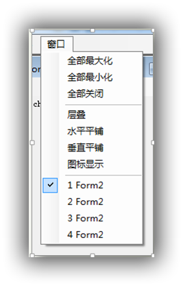

焦点设置？
textBox 显示默认灰色字体

### WF1 基本概念

#### 项目结构简介

- Program.cs ：启动程序，系统维护
- From1.cs：设计页面，Form1 分部类文件
- Form1.Designer.cs：系统自己维护，和界面相关的代码，Form1 分部类文件
- Form1.resx：资源

#### 常用控件

Label：简写 lbl
TextBox：txt，可进行多行显示
Button：btn
ListBox：lst，方法--Items.Add() / Items.Clear()

#### 事件的实现细节：

```c#
// 在From1.cs创建方法
private void btnOK_Click(object sender, EventArgs e)
        {
            Console.WriteLine("你的名字是：");
        }
// 在Form1.Designer.cs中，会将方法添加到事件处理器中     
this.btnOK.Click += new System.EventHandler(this.btnOK_Click);
```

#### 常用函数

MessageBox：显示消息窗口（也称为对话框）向用户展示消息。 这是一个模式窗口，可阻止应用程序中的其他操作，直到用户将其关闭。 System.Windows.Forms.MessageBox，可包含通知并指示用户的文本、按钮和符号。

```c#
// public static DialogResult Show(string text, string caption, MessageBoxButtons buttons); 该重载可向MessageBox中添加按钮，并可通过返回值获取按钮点击的信息
private void btnOK_Click(object sender, EventArgs e)
        {
            if (MessageBox.Show(txtName.Text, "名字", MessageBoxButtons.OKCancel) == DialogResult.Cancel)
            {
                Console.WriteLine("取消");
            }
```

#### 在窗体中显示自定义对话框

```c#
private void btnShowForm_Click(object sender, EventArgs e)
{
    var frm = new Form2(); // Form2是自定义窗体
    frm.Show();// 非模态对话框
    //frm.ShowDialog();// 模态对话框
    //frm.Hide(); // 对非模态对话框有效，隐藏对话框
    //frm.Close(); // 对非模态对话框有效，关闭对话框
}
```

https://docs.microsoft.com/zh-cn/dotnet/framework/winforms/how-to-display-dialog-boxes-for-windows-forms

#### 窗体 Form

Load 事件，每当用户加载窗体时执行。对应存在 FormClosed 和 FormClosing

```c#
private void Form1_Load(object sender, EventArgs e)
{
    txtName.Text = "hello";
}
```

##### 常用属性

- Name：窗体类的名称
- Text ：标题
- WindowState：确定窗体的初始可视状态
- AcceptButton ：
- CancelButton
- MaximizeBox

### WF2 菜单 托盘 工具栏 状态栏

#### 菜单

MenuStrip 控件：缩写 mnu

举例菜单的事件(退出程序 MessageBox)

```c#
private void 退出ToolStripMenuItem_Click(object sender, EventArgs e)
{
    if (MessageBox.Show("确定退出?", "标题栏", MessageBoxButtons.OKCancel) == DialogResult.OK)
    {
        //this.Close(); 注意体会这两种关闭方式的区别
        Application.Exit();
    }
}
```

分割线，菜单栏 右键插入

快捷键：1. 使用 `&` 符号；2. 使用属性 `ShortcutKeys` /  `ShowShortcutKeys` / `ShortcutKeyDisplayString`

添加图片：`Image` 属性

处理对整个菜单的每个项目都响应的事件，可在 `menuStrip` 下建立相关事件。（如统计菜单点击次数）

```c#
int count = 0;
private void menuStrip1_ItemClicked(object sender, ToolStripItemClickedEventArgs e)
{
    count++;
    Console.WriteLine(count); // 输出菜单的点击次数
    if (e.ClickedItem == 文件ToolStripMenuItem) // 核对点击的菜单项
    {
        Console.WriteLine("文件ToolStripMenuItem");
    }
}
```

#### 右键菜单

ContextMenuStrip 控件：cmnu

对需要右键菜单的控件，应在其 属性 > 行为 > ContextMenuStrip 中添加已创建的ContextMenuStrip 控件

直接将某右键菜单关联到菜单栏中：选择菜单项：属性>数据>DropDown(下拉列表)

#### 托盘图标

NotifyIcon 控件

属性：

- `icon` -- 设置托盘图标
- `ContextMenuStrip` -- 关联上下文菜单

示例，点击窗体的关闭按钮后隐藏窗体，之后通过双击托盘图标重新显示窗体

```c#
// 用户点击关闭图标后，隐藏窗体
private void formMain_FormClosing(object sender, FormClosingEventArgs e)
{
    if (e.CloseReason == CloseReason.UserClosing)
    {
        e.Cancel = true;// 取消该事件
        this.Hide();// 隐藏窗体
    }
}
// 用户点击托盘图标后显示窗体
private void notifyIcon1_DoubleClick(object sender, EventArgs e)
{
    this.Show();// 通过双击托盘图标，重新显示窗体
}
```

示例：设置气泡标题和内容、并显示

```c#
// 用户点击关闭图标后，隐藏窗体
private void formMain_FormClosing(object sender, FormClosingEventArgs e)
{
    if (e.CloseReason == CloseReason.UserClosing)
    {
        e.Cancel = true;// 取消该事件
        notifyIcon1.BalloonTipTitle = "注意";
        notifyIcon1.BalloonTipText = "双击重启";
        notifyIcon1.ShowBalloonTip(1000);
        this.Hide();// 隐藏窗体
    }
}
// 用户点击托盘图标后显示窗体
private void notifyIcon1_DoubleClick(object sender, EventArgs e)
{
    this.Show();// 通过双击托盘图标，重新显示窗体
}
```

#### 工具栏

ToolStrip 控件

插入标准项：右键控件，选择插入标准项

#### 状态栏

StatusStrip

```c#
private void formMain_MouseMove(object sender, MouseEventArgs e)
{
    // 在状态栏中显示鼠标位置
    toolStripStatusLabel1.Text = e.X.ToString() + "  " + e.Y.ToString();
}

private void formMain_Load(object sender, EventArgs e)
{
    // 在状态栏中显示日期
    toolStripStatusLabel1.Text = DateTime.Now.ToString();
}
```

#### Timer 定时器控件

Timer  tmr 不可视控件

Enable 属性 -- 开启定时器；Interval 属性 -- 设置时间间隔

方法  Start 和 Stop 启动和停止计时器，相当于设置 Enable 的值

事件  Tick：每隔 Interval 触发一次事件

```c#
private void timer1_Tick(object sender, EventArgs e)
{
    // 定期更新状态栏中显示的时间
    toolStripStatusLabel1.Text = DateTime.Now.ToString();
}
```

### WF3 其他一些控件

#### Show(Owner)/ShowDialog(Owner)

`public void Show(IWin32Window owner);` 参数 `owner` 用于表示对话框的拥有者。在对话框中可通过 `owner` 参数操作上级窗体中的控件。

```C#
// 通过Owner窗体中的按钮显示子对话框
private void btnOwner_Click(object sender, EventArgs e)
{
    var frm = new Form2();
    frm.Show(this);
}

// 在子对话框中通过按钮修改Owner窗体中的lable，
// 需要在Owner的*.Designer.cs文件中将lable设置为Public
private void btnChild_Click(object sender, EventArgs e)
{
    (this.Owner as Form1).lblOwner.Text = "测试";
}
```

#### 单选按钮

RadioButton  radXxx

Checked 属性：设置默认项

CheckedChanged 事件：选中状态改变时(选中或取消)，触发该事件

```c#
private void radMale_CheckedChanged(object sender, EventArgs e)
{
    lblGender.Text = (sender as RadioButton).Text;
}

private void radFemale_CheckedChanged(object sender, EventArgs e)
{
    lblGender.Text = (sender as RadioButton).Text;
}
```

#### 复选框

CheckBox  chkXxx

Checked 属性：设置默认选项

CheckedChanged 事件：选中状态改变时，触发该事件

```c#
// 通过复选框控制状态栏的显示和隐藏
private void chkShowStatusBar_CheckedChanged(object sender, EventArgs e)
{
    this.statusStrip1.Visible = (sender as CheckBox).Checked;
}
```

#### GroupBox 

GroupBox  grpXxx

Controls 属性：获取 GroupBox 中多包涵的控件的集合

用法：比如对 单选按钮 RadioButton 进行分组，每个 GroupBox 内的 RadioButton 互斥，但对 GroupBox  以外的 RadioButton 没有影响。

```c#
// 通过sender设置Owner窗体的字体
private void SetFont(object sender, EventArgs e)
{
    var radBtn = sender as RadioButton;
    if (radBtn.Checked)
    {
        (Owner as Form1).Font = new Font(radBtn.Font, FontStyle.Regular);
    }
}

// 初始化对话框窗体时，通过groupBox1.Controls对各个字体的RadioButton
// 都添加CheckedChanged委托
private void Form2_Load(object sender, EventArgs e)
{
    foreach (var ctr in groupBox1.Controls)
    {
        if ( ctr is RadioButton)
        {
            (ctr as RadioButton).CheckedChanged += new System.EventHandler(this.SetFont);
        }
    }
}
```

#### 下拉框

ComboBox  cboXxx

属性  Items  Text  

`DropDownStyle` 属性：控制组合框的外观和功能
`SelectedIndex`  属性：获取当前选中项的索引
`SelectedItem` 属性：获取当前选定项

`SelectedIndexChanged` 事件：索引改变时，便会触发该事件

在绑定数据库后，还可通过 ComboBox  显示的内容，拿到其背后的值

```c#
private void Form1_Load(object sender, EventArgs e)
{
    for (int i = 0; i < 10; i++)
    {
        cboNums.Items.Add(i+10);
    }
}
private void comboBox1_SelectedIndexChanged(object sender, EventArgs e)
{
    Console.WriteLine(cboNums.SelectedIndex);
    Console.WriteLine(cboNums.SelectedItem);
}
```

#### PictureBox 

PictureBox  picXxx

Image  属性：通过项目资源添加图片
ImageLocation 属性：直接设置图片路径即可
SizeMode  属性：图像显示模式
BorderStyle 属性：为 PictureBox 空间添加边框

```c#
private void btnAddImage_Click(object sender, EventArgs e)
{
    // 先通过工具箱添加openFileDialog控件，然后可进行以下操作
    // 通过文件对话框，加载图片
    if (openFileDialog1.ShowDialog() == DialogResult.OK)
    {
        // 通过Image类加载图片
        picBox.Image = Image.FromFile(openFileDialog1.FileName);
    }
    else
    {
        // 使用资源文件中的图片
        picBox.Image = Properties.Resources.幻灯片1;
    }
}
```

Click 事件

##### openFileDialog 

不可视控件

#### ImageList

存放图像的列表，不可视控件

Images 属性：用于添加图片，以形成图片列表  

该控件没有事件和方法

```c#
private void button1_Click(object sender, EventArgs e)
{
    // 按钮控制是否循环播放图片列表
    if (tmr.Enabled) tmr.Stop();
    else tmr.Start();
}

int i = 0;
private void tmr_Tick(object sender, EventArgs e)
{
    // 循环显示imageList1中的图片
    picBox.Image = imageList1.Images[i++ % imageList1.Images.Count];
}
```

#### ProgressBar  

ProgressBar  pgr

Maximum / Minimum 属性：最大值和最小值
Value 属性：当前值|
Step 属性：调用 PerformStep 方法时，控件值的增量

Increment 方法：指定增量
PerformStep 方法：调用时增加 Step 值

#### TabControl 

TabControl  tab

SelectedIndexChanged 属性值更改时触发

#### 控件布局

视图 -> 其他视图 -> 文档大纲

位置固定属性：Anchor 将控件锚定到窗体边缘，当窗体缩放时，控件与窗体间的距离保持恒定；Dock 将控件停靠到窗体的边缘。

TabIndex 属性：定义用 Tab 选择控件的顺序

```c#
private void button4_Click(object sender, EventArgs e)
{
    button4.BringToFront(); // 将按钮置于最顶层
}
```

### WF4 多文档窗口 与 控件布局

多文档窗体 Multiple Document Interface：MDI

编写 MDI

1. 主窗体选择 IsMdiContainer 属性：确定该窗体属于 MDI 容器
2. 子窗体选择 MdiParent 属性：设置多文档界面中子窗体的父窗体。
   子窗体的菜单默认自动合并到主窗体的菜单中，设置子窗体菜单栏的 AllowMerge 可取消合并。

#### MDI 主窗口

MdiChildren 属性：获取当前父窗体下所有的子窗体构成的数组
MdiParent 属性
ActiveMdiChild 属性：在父窗体中获取当前活动的多文档界面 (MDI) 子窗口。

ActivateMdiChild 方法：激活某个 MDI 子窗口
LayoutMdi 方法：对 MDI 进行排版

事件 MdiChildActivate MDI 窗口激活时，会触发该事件，位于主窗体的事件列表中

菜单栏的 MdiWindowListItem 属性，用于指定菜单栏中的哪一项被用于显示 MDI 窗口。

示例，实现下面的功能：改变子窗口布局、显示所有子窗口、带有 保存/打开 的多文档



```c#
// 将全部Mdi窗口最大化
private void 全部最大化ToolStripMenuItem_Click(object sender, EventArgs e)
{
    foreach (var frm in this.MdiChildren)
    {
        frm.WindowState = FormWindowState.Maximized;
    }
}
// 将全部Mdi窗口最小化
private void 全部最小化ToolStripMenuItem_Click(object sender, EventArgs e)
{
    foreach (var frm in this.MdiChildren)
    {
        frm.WindowState = FormWindowState.Minimized;
    }
}
// 将全部Mdi窗口关闭
private void 全部关闭ToolStripMenuItem_Click(object sender, EventArgs e)
{
    foreach (var frm in this.MdiChildren)
    {
        frm.Close();
    }
}
// 将全部Mdi窗口层叠
private void 层叠ToolStripMenuItem_Click(object sender, EventArgs e)
{
    foreach (var frm in this.MdiChildren)
    {
        this.LayoutMdi(MdiLayout.Cascade);
    }
}
// 选择 打开 菜单后，会显示openFileDialog对话框
private void 打开ToolStripMenuItem_Click(object sender, EventArgs e)
{
    openFileDialog.ShowDialog();

}
// 在openFileDialog点击确定后，会打开文件
private void openFileDialog_FileOk(object sender, CancelEventArgs e)
{
    var fileName = openFileDialog.FileName;
    var frm = new FormChild();
    frm.MdiParent = this;
    frm.Text = new FileInfo(fileName).Name;
    // 需要修改txtBox控件的可见性，通过modifiers属性可修改
    frm.txtBox.Text = File.ReadAllText(fileName);
    frm.Show();
}
// 在saveFileDialog1中点击确定按钮后，会进行保存
private void saveFileDialog1_FileOk(object sender, CancelEventArgs e)
{
    var fileName = saveFileDialog1.FileName;
    var content = (ActiveMdiChild as FormChild).txtBox.Text;
    File.WriteAllText(fileName, content);
}
// 选择 另存为 菜单后，会显示saveFileDialog1对话框
private void 另存为ToolStripMenuItem_Click(object sender, EventArgs e)
{
    if (this.ActiveMdiChild != null)
    {
        saveFileDialog1.ShowDialog();
    }
}
```

### WF5

#### TreeView 

TreeView  tvwXxx

属性    Nodes  SelectedNode

方法：
CollapseAll() // 折叠所有节点
ExpandAll() // 展开所有节点
GetNodeCount(true) // 统计节点的数量

事件：
BeforeCollapse // 将要折叠节点前触发
BeforeExpand // 将要展开节点前触发
BeforeSelect // 将要更改选定内容前触发
After… // 以上事件有以 after 开头的类似方法

```c#
private void Form1_Load(object sender, EventArgs e)
{
    List<string> list1 = new List<string>() { "1", "2", "3" };
    List<string> list2 = new List<string>() { "1.1", "1.2", "1.3" };
    foreach (var outerItem in list1)
    {
        var node = new TreeNode(outerItem);
        // 向TreeView控件中添加跟节点  
        // 可以在属性窗口中，通过Nodes进行添加
        tvwFile.Nodes.Add(node);
        foreach (var innerItem in list2)
        {
            // 向根节点上添加新的节点
            node.Nodes.Add(new TreeNode(innerItem));
        }
    }
    tvwFile.CollapseAll(); // 折叠所有节点
    tvwFile.ExpandAll(); // 展开所有节点
    label1.Text = tvwFile.GetNodeCount(true).ToString(); // 统计节点的数量
}
```

#### Split

SplitContainer 拥有分割线的容器
没有看到 Split 空间，但在视频中有该控件

#### ListView 

ListView  lvwXxx 类似于文件管理器的详细模式

属性：
Columns //  在“详细信息”视图中显示的列
Items  // ListView 中的项
View  // 指定 ListView 的显示方式
MultiSelect  // 是否允许选择多项
CheckBoxes // 是否显示复选框
FullRowSelect // 当选中某项时，其所有子项也会一起突出显示

```c#
namespace WindowsFormsApp6
{
    public partial class Form1 : Form
    {/// <summary>
     /// 利用TreeView和ListView编写一个简单的资源查看器
     /// 并演示了TreeView和ListView和SplitContainer的使用方法
     /// </summary>
        public Form1()
        {
            InitializeComponent();
        }

        private void LoadSubDir(TreeNode node)
        {
            try //部分文件会被系统拒绝访问
            {
                // node.Text仅包含文件名，不包含完整路径，
                // 需要使用Tag存放完整的路径
                foreach (var dirInfo in new DirectoryInfo(node.Tag.ToString()).GetDirectories())
                {
                    var n = new TreeNode(dirInfo.Name);
                    n.Tag = dirInfo.FullName;
                    node.Nodes.Add(n);
                }
            }
            catch (Exception)
            {

            }
        }

        private void Form1_Load(object sender, EventArgs e)
        {
            // 设置ListView
            lvwFiles.Columns.Add("文件名", 100);
            lvwFiles.Columns.Add("大小", 100);
            lvwFiles.Columns.Add("最后访问时间", 100);
            lvwFiles.View = View.Details;
            // 在TreeView中显示盘符和第一层目录
            foreach (var drive in Environment.GetLogicalDrives())
            {
                var node = new TreeNode(drive);
                tvwFile.Nodes.Add(node);
                node.Tag = drive; // 可根据需求放置任意值
                LoadSubDir(node);
            }
        }

        // 将要展开某节点前，加载其子节点下的文件夹
        private void tvwFile_BeforeExpand(object sender, TreeViewCancelEventArgs e)
        {
            foreach (TreeNode node in e.Node.Nodes)
            {
                LoadSubDir(node);
            }

        }
        // 折叠节点后，清理子项下的Nodes对象
        private void tvwFile_AfterCollapse(object sender, TreeViewEventArgs e)
        {
            foreach (TreeNode node in e.Node.Nodes)
            {
                node.Nodes.Clear();
            }
        }
        // 在选中TreeView中的节点后，会在ListView中显示该项中的文件夹
        private void tvwFile_AfterSelect(object sender, TreeViewEventArgs e)
        {
            lvwFiles.Items.Clear();
            try
            {
                foreach (var fileInfo in new DirectoryInfo(e.Node.Tag.ToString()).GetFiles())
                {
                    var item = new ListViewItem(fileInfo.Name);
                    lvwFiles.Items.Add(item);
                    item.SubItems.Add(fileInfo.Length.ToString());
                    item.SubItems.Add(fileInfo.LastAccessTime.ToLocalTime().ToString("yyyy-MM-dd HH:mm:ss"));
                }
            }
            catch (Exception)
            {
            }

        }

        private void tvwFile_BeforeSelect(object sender, TreeViewCancelEventArgs e)
        {
        }

        private void splitContainer1_Panel2_Paint(object sender, PaintEventArgs e)
        {

        }
    }
}
```

#### 其他

##### Clipboard 剪贴板

```c#
Clipboard.SetText("123");// 执行后剪贴板中会存放"123"
```

##### 通用对话框

对话框工具箱中的控件

##### BackgroundWorkor

在单独的线程上执行操作

```c#
public partial class Form1 : Form
    {
        public Form1()
        {
            InitializeComponent();
        }


        private void backgroundWorker1_DoWork(object sender, DoWorkEventArgs e)
        {
            for (int i = 0; i < 100; i++)
            {
                Thread.Sleep(100);
                toolStripStatusLabel1.Text = "backgroundWorker1忙"; //状态栏label
                toolStripProgressBar1.PerformStep();//状态栏进度条
            }
        }

        private void backgroundWorker1_RunWorkerCompleted(object sender, RunWorkerCompletedEventArgs e)
        {
            toolStripStatusLabel1.Text = "backgroundWorker1完成";
        }

        private void Form1_Load(object sender, EventArgs e)
        {
            // 如果没有此代码，则跨线程调用控件
            Control.CheckForIllegalCrossThreadCalls = false;
        }

        private void button1_Click(object sender, EventArgs e)
        {
            backgroundWorker1.RunWorkerAsync();// 通过按钮异步执行backgroundWorker1
        }
    }
```


##### 报表

缺少报表，需要另外安装。
ReportViewer 控件
另外还有一种东西叫做水晶报表

### WF6 事件驱动的本质

#### 示例1  在窗体中捕获设备改动的消息

窗体会捕获由于设备改动产生的消息，比如插拔 USB。

本实例由于是捕获消息所以并不需要知道handle，只需要知道消息的内容和参数
[WM_DEVICECHANGE](https://msdn.microsoft.com/en-us/library/aa363480(VS.85).aspx) ：WM 表示WindowsMessage

```c#
protected override void WndProc(ref Message m)
{//WndProc用于处理windows消息
    if (m.Msg == 0x219) // 0x219是表示设备更改的ID号
    {
        Console.WriteLine("WM_DEVICECHANGE message");
    }
    base.WndProc(ref m);
}
```

#### 示例2 窗体捕获鼠标左键的点击

```c#
const int WM_LBUTTONDOWN = 0x0201;//0x0201表示消息ID
// 只会在窗体上捕捉消息，不会在控件上捕捉消息
protected override void WndProc(ref Message m)
{//WndProc用于处理windows消息
    if (m.Msg == WM_LBUTTONDOWN)
    {
        Console.WriteLine("WM_LBUTTONDOWN message 左键按下消息");
    }
    base.WndProc(ref m);
}
```

#### 案例2  控件 捕获消息

模拟鼠标单击事件
[WM_LBUTTONDOWN](https://msdn.microsoft.com/en-us/library/windows/desktop/ms645607(v=vs.85).aspx#)  `#define WM_LBUTTONDOWN 0x0201`

属性窗口中的事件实际是对消息的封装

```c#
namespace WindowsFormsApp1
{
    public partial class Form1 : Form
    {
        public Form1()
        {
            InitializeComponent();
        }
        // button1在收到点击消息后，会自动执行Click事件，
        // button1_Click存放在事件的委托中
        private void button1_Click(object sender, EventArgs e)
        {
            Console.WriteLine("button1_Click");
        }
        // myButton1在收到消息后，由WndProc方法筛选出点击消息,
        // 并执行Click委托
        private void myButton1_Click(object sender, EventArgs e)
        {
            Console.WriteLine("myButton1_Click");
        }
        // 还需要在private void InitializeComponent()中增加
        // this.myButton1.Click = this.myButton1_Click;
        
    }
    class MyButton : Button
    {
    	// 一定要声明为空委托，也就是等于delegate{}，
    	// 这样即使后面没有给委托赋值，调用时也不会异常
    	// 如果省略delegate{}，则默认为null
    	// 如果后面没有给委托赋值，那么调用时会出现异常
        new public EventHandler<MyButtonArgs> Click = delegate{};
        const int WM_LBUTTONDOWN = 0x0201;//0x0201表示消息ID
        protected override void WndProc(ref Message m)
        {
            // 针对点击消息的ID，触发自定义事件
            // 由此可见，系统提供的各种事件，本质上是对消息处理的封装
            if (m.Msg == WM_LBUTTONDOWN)
            {
                // m.GetLParam();这里可以获取坐标
                Console.WriteLine("WM_LBUTTONDOWN message 自定义按钮左键按下消息");
                Click(this, new MyButtonArgs(50, 100)); // 点击鼠标时，便会触发事件
            }
            base.WndProc(ref m);
        }
    }
    class MyButtonArgs : System.EventArgs
    {
        public short x;
        public short y;
        public MyButtonArgs(short x, short y)
        {
            this.x = x; this.y = y;
        }
    }
}
```

事件机制：首先系统将消息投递给窗体，窗体再将消息投递给控件，控件根据消息类型分析出要调用的 event，再由 event 执行内部的委托，委托中会存放相应的方法——这些方法就是vs属性菜单中的事件。
vs 属性菜单中的事件，实际上表示的是在相应消息类型下调用的 event 中存放的方法。

#### WndProc 和 DefWndProc 

WndProc：处理windows消息，WndProc 无法捕获的信息便会扔给 DefWndProc，所以建议使用。也就是说 `base.WndProc(ref m)` 如果对相应消息进行了处理，便不会再抛给 DefWndProc。如果 `base.WndProc(ref m)` 中并没有处理相应的消息，那么便会抛给 DefWndProc。如果没有特殊需求，通常使用 WndProc。

DefWndProc：向默认窗口过程发送指定消息

案例4  发送消息  窗体间通信

使用  `const int WM_COPYDATA = 0x004A;`
发送消息需要知道：handle 消息内容 消息参数
关于 PostMessage 和 msg.result，视频中都是复制的代码，大概就那样。

#### 钩子 Hook

键盘钩子、鼠标钩子：如果窗体安装了钩子，便可以截获所有的键盘消息和鼠标消息

视屏中用到的第三方库：SystemHooksCompiledOnly，视频中都是复制的代码，大概就那样。

### WF7 几种设计模式 

已讲过的设计模式:
单例  6   类
工厂  7   继承
观察者  11   多播委托
迭代器  12   自定义集合
策略  17   最后部分

组合模式

```c#
    // 组合模式
    class Node // 根
    {
        List<INode> Nodes;
        void Draw() { Nodes.ForEach(node => node.Draw()); }
    }
    interface INode { void Draw(); }
    class NodeType1 : INode // 叶子节点
    {
        public void Draw() { }
    }
    class NodeType2 : INode
    {
        public void Draw() { }
    }
    class NodeType3 : INode
    {
        public void Draw() { }
    }
    /* 树状关系如下：
     * Node
     *  \-NodeType1
     *  \-NodeType2
     *  \-NodeType3
     *      \-Node
     *          \-NodeType3
     * 
     */
```

模板方法：大意是通过基类或接口给定一个模板，这样子类就使用这个模板。

策略模式：

```c#
 interface IGetData
    {
        void GetData();
    }
    class RainData : IGetData
    {
        public void GetData()
        {
            throw new NotImplementedException();
        }
    }
    class SeedData : IGetData
    {
        public void GetData()
        {
            throw new NotImplementedException();
        }
    }

    class DrawMap
    {
        // 策略模式，利用接口封闭类，使得类不会随着数据类型的增加而变化
        IGetData dataSet;
        void show() { /* 利用 dataSet.GetData 显示数据 */ }
    }
```

桥接模式：利用策略模式的思想，用接口逐个封装每个维度

状态模式:

### WF8


