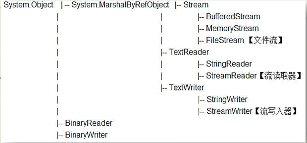
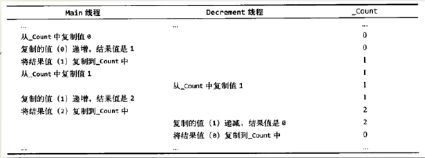
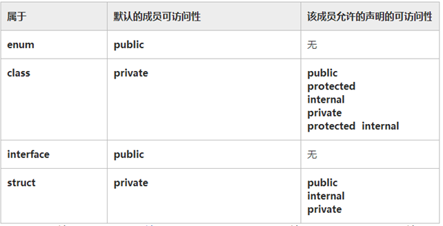

# 科技传播坊+C#视频 笔记

设计教材：

《[C# 本质论](https://intellitect.com/essentialcsharp/)》https://github.com/IntelliTect/EssentialCSharp/releases

《WinForm 技术应用》

csc.exe 默认没有添加到 Path 中，需要手动添加。在 Win 中搜索出 csc.exe 的位置并添加到 Path 中即可。也可直接运行 `Developer Command Prompt for VS 2017` ，在此命令行窗口中可直接执行 csc.exe 并且无需设置 Path。

空白符：不影响语法结构。

局部变量：变量位于函数内部，作用域也仅限于该函数。注意和字段进行区分

System.Console.Read(); System.Console.ReadKey();

### 第二讲

十六进制：0xff

System.Diagnostics.Stopwatch 秒表计时器

string.Empty 空字符串等于 `""`  ,但不等于 null

string.Builder 属于 class

null 专给引用类型使用，表示没有引用任何有效对象

```c#
int a = int.MaxValue;
a = checked(a++);
// 或
int a = int.MaxValue;
checked
{
    a = a++;
}
```

转换函数 Sysytem.Convert() 、ToString()

### 第三讲 运算符和分支结构

字符串用 + 号连接

浮点数运算

const 和 readonly

bool 的变量通常以 is 开头

### 第四讲 数组和循环

实践多用 List 类型。 

Random 产生随机数的类

List 集合

```c#
List<int> intNums = new List<int>() { 5, 2, 3 };
var doubleNums = new List<double>();
intNums.Add(4);
intNums.Sort();
intNums.Max();
intNums.Min();
```

### 第五讲 方法和参数

值参数：不会改变原字符串，因为字符串是不可变对象。

```
class Program
    {
        static void Fun(string str)
        {
            str += "!";
        }

        static void Main(string[] args)
        {
            string str = "123";
            Fun(str);
            Console.WriteLine(str);
            Console.ReadLine();
        }
    }
```

统计当前目录中的文件总数，包含子文件夹内的文件：演示递归

```c#
class Program
    {
        static long Fun(string path)
        {
            long count = 0;
            var files = Directory.GetFiles(path);
            count += files.Length;
            var dirs = Directory.GetDirectories(path);
            foreach (var item in dirs)
            {
                count += Fun(item);
            }
            return count;
        }

        static void Main(string[] args)
        {
            var result = Fun(@"C:\Users\iwhal\source\repos\SharpVideo\SharpVideo\bin");
            Console.WriteLine(result);
            Console.ReadLine();
        }
```

### 第六讲 类

设计模式： 在面向对象的基础上，抽象出一些公共的常见的方法。
设计模式——单例模式如下：

```c#
class DashBorad
    {
        private DashBorad() { } // 私有构造函数

        static private DashBorad _instance = null;
        static public DashBorad Instance
        {
            get
            {
                if (_instance == null)
                    _instance = new DashBorad();
                return _instance;
            }
        }
    }
    class Program
    {
        static void Main(string[] args)
        {
            DashBorad db1 = DashBorad.Instance;
            DashBorad db2 = DashBorad.Instance;
            // db1和db2指向栈中的同一个对象
            // 这就是所谓的单例模式，整个类只会提供一个实例
            Console.ReadLine();
        }
    }
```

### 第七讲 继承

is-a 是一个、属于；has-a 有一个、拥有

```c#
class Animal
    {
        public string Name { get; set; } // has-a
        public void Shout()
        {
            Console.WriteLine("{0}: Animal shout", Name);
        }
    }

    class Dog : Animal // is-a
    {
        public new void Shout()
        {
            Console.WriteLine("{0}: 汪汪", Name);
        }
    }
```

多态：一个类型，多种状态 ；virtual override (可用于 属性、方法)。目标：将变化**封闭** (注：override 可以 继续继承)

```c#
// 这个示例中，我们使用基类来完成实现多态
// 因为我们在基类中实现了鸭子，虽然会在子类中重写鸭子的内部
// 但是仍可通过基类类型的变量调用子类实例中的鸭子
abstract class Animal
    {
        public string Name { get; set; } // has-a
        public virtual void Shout();
    }

    class Dog : Animal // is-a
    {
        // 注意没有屏蔽 Name 属性
        public override void Shout()
        {
            Console.WriteLine("{0}: 汪汪", Name);
        }
    }
    class Program
    {
        static void Test(Animal animal) // 使用多态
        {
            Console.WriteLine(animal.Name);
            animal.Shout();
        }

        static void Main(string[] args)
        {
            var aDog = new Dog() { Name = "小黑" };
            Test(aDog);
            Console.ReadLine();
        }
    }
```

多态的设计思想在于，只有对象（而不是过程）知道如何执行一个特定的操作——比如上例中的Dog对象才直到如何执行 `Shout` 方法。通过规定这些操作的通用方式，利用共性促进代码重用。

sealed

- 应用于某个类时，`sealed` 修饰符可阻止其他类继承自该类。 在下面的示例中，类 `B`继承自类 `A`，但没有类可以继承自类 `B`。
- 还可以对替代基类中的虚方法或属性的方法或属性使用 `sealed` 修饰符。 这使你可以允许类派生自你的类并防止它们替代特定虚方法或属性。

**工厂模式**：设计模式

Sysytem.Object 的成员：《C# 本质论》中有讲解，这里演示成员的重载。

```c#
class A
    {
        int a = 1;
        public override string ToString()
        {
            //return base.ToString();
            //return this.GetType().ToString();
            //以上两者等效，是该方法的原有实现方式
            return "我属于A类";
        }
        public override bool Equals(object obj)//参数不可以改动
        {
            //return base.Equals(obj);
            //上面是默认实现方式
            return a == ((A)obj).a;
        }
    }
    abstract class B : A
    {

    }
    class Program
    {
        static void Main(string[] args)
        {
            A a = new A();
            Console.WriteLine(a);//输出 我属于A类

            A a1 = new A();
            A a2 = new A();
            Console.WriteLine(a1.Equals(a2));//输出 true
            Console.ReadLine();
        }
    }
```

### 第八讲 接口

接口同样可以实现多态的特性，可以用接口实现跨继承链的多态。继承 的作用是 共享代码，但继承 只有1次机会，并且不能实现跨继承链的多态。接口的使用频率通常会高于抽象类。继承主要用于表达一类相关的类型，但接口侧重于表达能完成某项操作，因此某些接口会以 able 结尾。

接口（首选） > 抽象类

```c#
namespace SharpVideo
{
    interface IFly
    {
        void Fly();
    }
    
    #region 动物类继承链
    abstract class Animal
    {
        public abstract string Name { get; set; }
        public Animal(string name)
        {
            Name = name;
        }
        public abstract void Shout();
    }
    class Dog : Animal
    {
        public override string Name { get; set; }
        public Dog(string name) : base(name) { }
        public override void Shout()
        {
            Console.WriteLine("我的品种是 {0}", Name);
        }
    }

    class Dove : Animal, IFly
    {
        public override string Name { get; set; }
        public Dove(string name) : base(name) { }
        public override void Shout()
        {
            Console.WriteLine("我的品种是 {0}", Name);
        }

        public void Fly()
        {
            Console.WriteLine("{0} 会飞", Name);
        }
    }
    #endregion

    #region 交通工具继承链
    abstract class Vehicle
    {
    }
    class Plane : Vehicle, IFly
    {
        public void Fly()
        {
            Console.WriteLine("飞机在飞");
        }
    }
    class Cat:Vehicle
    {

    }
    #endregion

    class Program
    {
       static void Main()
        {
            
            int a = 111;
            Console.WriteLine(a.GetType());
            Console.ReadLine();
        }
    }
}
```


UML：资源管理器，右键.cs文件，选择查看类图

设计模式：策略模式，会在 winform 中讲解

### 第九讲 各种细节

泛型：[类型参数的约束](https://docs.microsoft.com/zh-cn/dotnet/csharp/programming-guide/generics/constraints-on-type-parameters)

VS 的程序结构：

- `.sln` -- 解决方案 *solution*，一个解决方案可以包含多个项目。

- 项目是和解决方案同在一个目录下的文件夹，项目中包含了许多的命名空间。项目也叫做程序集 Assembly (或包、模块)——在AssemblyInfo.cs中可查看程序集的相关信息。一个项目可表现为 dll 或 exe。在项目属性中，可修改输出类型：应用程序、类库

dll：动态链接库，不可独立运行，就像组件一样。

- 手工导入：添加引用即可，引用后便存在依赖关系，右键 项目>生成依赖关系中可以查看
- [DllImport(…)]，仅用于方法。

垃圾回收：内存管理的一种方式。内存分为栈和堆，new 操作符会在堆上开辟内存，new 是托管堆。由垃圾回收的代码，称作托管代码。[参考](http://www.bandgap.cs.rice.edu/classes/comp410/resources/Michael%20Stuart%20and%20Chris%20Wafer%20lectures/RiceLectures/Garbage%20Collection%20Automatic%20Memory%20Management%20in%20the%20Microsoft%20_NET%20Framework%20--%20MSDN%20Magazine,%20November%202000.htm) 

资源清理：确定性终结，C#本质论>9.7资源清理 中有讲解

```C#
// 演示了IDisposable接口，和using方法
class Test : IDisposable
    {
        public void Dispose()
        {
            Console.WriteLine("Disposable");
        }
    }
    class Program
    {
        static void Main()
        {
            Console.WriteLine("befor using");
            using (var test = new Test())
            {

            }
            Console.WriteLine("after using");
            Console.ReadLine();
        }
    }
```

弱引用 和 延迟初始化 没有讲 C#本质论

### 第十讲 委托Lambda

`delegate { }` 用于定义空委托，如果委托是 null，调用时会出现异常。但是`delegate { }` 却不会

下面的示例展示了各种可用于委托的形式

```c#
delegate bool MyDel(int value);
    class Program
    {
        static bool GreatThan10(int num) // 可以将函数直接投递给委托
        {
            return num > 10;
        }

        static readonly MyDel LessThan10 = delegate (int n) { return n < 10; };// 使用匿名方法创建委托
        static MyDel Equ10 = x => x == 10; // 利用lanmda创建委托

        static List<int> Travarse(List<int> intNums, MyDel myDel)
        {
            List<int> nums = new List<int>();
            foreach (var item in intNums)
            {
                if (myDel(item))
                {
                    nums.Add(item);
                }
            }
            return nums;
        }
        static void Main()
        {
            List<int> intNums = new List<int> { 1, 2, 3, 4, 5, 10, 11 };
            foreach (var item in Travarse(intNums, x => true)) // 在委托处，直接使用Lambda
            {
                Console.Write("{0},", item);
            }

            Console.ReadLine();
        }
    }
```

系统自带的泛型委托：

`Action<>` 如 `List<T>.ForEach()`

`Func<>` 如 `List<T>.Sum()` 
-- `public static int Sum<TSource>(this IEnumerable<TSource> source, Func<TSource, int> selector);`

`Predicate<>` 如 `List<T>.FindAll()` 、`List<T>.Find ()` Predicate谓语

```c#
static void FuncTest(int n, Func<int, bool> func) //使用系统自带的泛型委托
        {
            Console.WriteLine(func(n));
        }
static void Main()
{
    FuncTest(10, x => x > 10);//使用系统自带的泛型委托

    List<int> intNums = new List<int> { 1, 2, 3, 4, 5, 10, 11 };
    intNums.ForEach(i => Console.Write("{0},", i));
    Console.WriteLine();
    Console.WriteLine(intNums.Sum(i => { if (i < 10) return 0; else return i; }));
    intNums.Find(i => i > 5);
    Console.ReadLine();
        }
```

Lambda 访问外部变量

```c#
static void Main()
        {
            List<int> intNums = new List<int> { 1, 2, 3, 4, 5, 10, 11 };
            int n = 9;
            intNums.Find(i =>
            {
                Console.WriteLine(n);
                return i > 5;
            });
            Console.ReadLine();
        }
```

表达式树

### 第十一讲 多播委托 事件

面向接口编程的主要思想是将公共操作统一到接口

设计模式：发布者订阅模式 ，也称观察者模式《c# 图解教程》上有

- 订阅、注册：向委托链中添加方法
- 退订、取消注册：从委托中删除方法
- 发布、通知、广播：执行多播委托

委托链的异常处理：

```C#
class NewsMessage
    {
        public string Message { get; set; }
    }

    class Subscriber
    {
        public NewsMessage Message { get; set; }
        public void SetNewsPaper(NewsMessage message)
        {
            this.Message = message;
        }
        public void ShowMessage()
        {
            Console.WriteLine(Message);
        }
    }

    class Promulgator
    {
        public event Action<NewsMessage> Subscriber;
        public void SendNewsPaper(NewsMessage message)
        {
            if (Subscriber != null)
            {
                foreach (Action<NewsMessage> handler in Subscriber.GetInvocationList())
                {
                    try
                    {
                        // 委托链的异常处理
                        handler(message);//对于有 ref、out、非void 的处理
                        // 如果 Subscriber 存在返回值，可以在这里依次处理
                        // 如果 直接调用Subscriber则无法依次进行处理
                    }
                    catch (Exception ex)
                    {
                        Console.WriteLine(ex.Message);
                    }
                }
                //Subscriber(newsPaper); // 发布、广播、通知
            }
        }
    }


    class Program
    {

        static void Main()
        {
            Subscriber A = new Subscriber();
            var promulgator = new Promulgator();

            promulgator.Subscriber += A.SetNewsPaper;
            promulgator.Subscriber += n => { throw new ApplicationException("这有一个异常"); };
            promulgator.SendNewsPaper(new NewsMessage() { Message = "新消息" });

            Console.Read();
        }
    }
```

外部类：调用其它类的类；包容类：被其它类调用了的类

### 第十二讲 自定义集合 常用集合

设计模式——迭代器模式

集合：实现了 IEnumerable 接口的类被称作集合

```c#
// 下面的类实现了迭代器
class MyClass:IEnumerable<int> // 使用了接口，C#图解教程中并没有写出接口
    {
        public int a;

        public IEnumerator<int> GetEnumerator()
        {
            yield return 1;
            yield return 2;
            yield return 3;
        }

        IEnumerator IEnumerable.GetEnumerator() // 与C#图解教程有区别
        {
            return GetEnumerator();
        }
    }
```

常用集合：`List<T>` 
`Dictionary<TKey, TValue>` 字典的遍历  字典的字典  键值数据库

```c#
static void Main()
        {
            var dic = new Dictionary<int, string>();
            dic.Add(1, "one");
            dic.Add(2, "one");
            dic[1] = "a"; // 修改值
            foreach (var item in dic)
            {
                Console.WriteLine("{} {}",item.Key,item.Value)
            }


            Console.Read();
        }
```

`SortedList<>` `SortedDictionary<>` `SortedSet<>`;

`Stack<T>` 栈、 `Queue<T>` 队列、`LinkedList<T>` 双向链表

各类集合接口 `IList<>` / `IComparable`    

索引运算符

### 第十三讲 扩展方法 查询表达式

```c#
static void Main()
        {
            var list = new List<int> { 1, 2, 3, 4 }; // 集合初始化器
            var myClass = new MyClass() { a = 1 }; // 对象初始化器

            Console.Read();
        }
```

`Where` 减少数据总数，在数据对象的集合中，筛选符合条件的数据对象，最终得到由这些数据对象构成的集合。
Select 减少数据字段 或 彻底改变数据，选取数据对象的集合中每个对象中的某一部分，并把改动后的对象组成一个新的集合。

`Count`：如果需要执行 `If(list.Count() > 0){…}`，建议使用 `list.Any()`

排序 `OrderBy` / `ThenBy` ：每个句子只能有一个 `OrderBy()`，后面可接多个 `ThenBy()` 。如果出现多个 `OrderBy()` ，那么最后一个 `OrderBy()` 会覆盖之前所有的 `OrderBy()` 。

分组 `GroupBy ()` 

连接 `Join()`  

`Distinct`    删除重复

`Union`  并集

`Intersect`  交集

`Concat`  连接

延迟查询

SelectMany()  ：处理集合的集合

左外连接、右外连接、全外连接

### 第十四讲 LINQ

```c#
{
var filePaths = Directory.GetFiles(@"C:\Users\iwhal\Documents\GitHub\c_sharp_notes\documents");
    var query = from x in filePaths
        let fileInfo = new FileInfo(x)
        select new { fileInfo.CreationTime, fileInfo.LastWriteTime };
            }
```

使用 group xx by xx into xx  分组，into 也被称作管道符

select 嵌套 

详细内容看《LINQ IN ACTION》 

### 第十五讲 反射  特性  序列化 动态编程

测试是否引用相同的对象 `object.ReferenceEquals()`

元数据：指数据的数据，比如 txt 文件中存储的文本内容被视作数据，文件名、创建时间可被看作元数据。

反射：运行时，操作某个类型的元数据，反射是操作一个类型的类型。

Type 中的一些成员： Type.IsPublic / Type.BaseType / Type.GetInterfaces()

反射的基本使用方法，示例：

```c#
namespace SharpVideo
{
    class A
    {
        public string MyProperty { get; set; }
        public void Function(int a) { Console.WriteLine(a); }
        public void MethodA() { Console.WriteLine("Method A"); }
        public void MethodB() { Console.WriteLine("Method B"); }

    }
    class Program
    {
        static void Main()
        {
            var a = new A();
            var type1 = typeof(A);
            // 设置属性值
            var property = type1.GetProperty("MyProperty");
            property.SetValue(a, "设置值");
            Console.WriteLine(a.MyProperty);
            // 通过反射调用方法
            var function = type1.GetMethod("Function");
            function.Invoke(a, new object[] { 1 });
            // 从控制台获取方法名称，然后通过反射调用
            var method = type1.GetMethod(Console.ReadLine());
            method.Invoke(a, null);

            Console.Read();
        }
    }
}
```

根据字符串创建类实例：Assembly .Load("程序集名称") .CreateInstance("命名空间.类名")。Assembly（程序集）
配合接口使用，封闭变化的利器

```c#
namespace SharpVideo
{
    interface IInterface
    {
        void MethodA();
        void MethodB();

    }
    public class A : IInterface
    {
        public string MyProperty { get; set; }
        public void Function(int a) { Console.WriteLine(a); }
        public void MethodA() { Console.WriteLine("A.Method A"); }
        public void MethodB() { Console.WriteLine("A.Method B"); }
    }
    public class B : IInterface
    {
        public string MyProperty { get; set; }
        public void Function(int a) { Console.WriteLine(a); }
        public void MethodA() { Console.WriteLine("B.Method A"); }
        public void MethodB() { Console.WriteLine("B.Method B"); }
    }
    class Program
    {
        static void Main()
        {
            // 通过从控制台输入的字符串创建类实例
            var obj = (IInterface)Assembly.Load("SharpVideo").
                CreateInstance("SharpVideo." + Console.ReadLine());
            // 获取指定的实例方法，并调用该方法
            var method = obj.GetType().GetMethod(Console.ReadLine());
            method.Invoke(obj, null);
            Console.Read();
        }
    }
}
```

#### 特性

程序集中的特性位于 AssemblyInfo.cs。
特性用于提供额外的元数据，或是提供如何使用或处理代码的有关信息。

#### 序列化 / 反序列化

BinaryFormatter.Serialize

BinaryFormatter.Deserialize

示例：如何将一个实例 序列化为文件，然后 反序列化

```c#
namespace SharpVideo
{
    [Serializable]
    public class A
    {
        public string str1 = "123";
    }

    class Program
    {
        static void Main()
        {
            var begin = new A();
            // 序列化
            using (var steam = File.Open(typeof(A).Name + ".bin", FileMode.OpenOrCreate, FileAccess.ReadWrite))
            {
                var bf = new BinaryFormatter();
                bf.Serialize(steam, begin);
            }
            A after = null;
            // 反序列化
            using (var steam = File.Open(typeof(A).Name + ".bin",FileMode.Open,FileAccess.Read))
            {
                var bf = new BinaryFormatter();
                after = (A) bf.Deserialize(steam);//需要显式类型转换
            }
            Console.WriteLine(after.str1);
            Console.Read();
        }
    }
}
```


Stream 是所有流的抽象基类，流是字节序列的抽象概念，如文件、输入输出设备、内部进程通信管道或 TCP/IP 套接字。



#### 动态编程

`dynamic` 动态类型关键字。

### 第十六讲 多线程 同步

线程之间可以共享数据，线程在本质上是切换执行的

#### 创建线程

1. 使用 `Task(Action action)` 创建线程，无返回值。关于 [Task 类](https://docs.microsoft.com/zh-cn/dotnet/api/system.threading.tasks?view=netframework-4.7.2) 的参考。

   ```c#
   namespace SharpVideo
   {
   
       class Program
       {
           static void Main()
           {
               int times = 10000;// 线程间可共享数据，所以后面的线程中可调用该字段
               // 创建线程
               // Task Class 表示一个异步操作
               var task1 = new Task(() =>
               {
                   for (int i = 0; i < times; i++)
                   {
                       if (i % 10 == 0) Console.Write("+");
                   }
               });// 不会立即执行，需要调用Start进行启动
   
               var task2 = new Task(() =>
               {
                   for (int i = 0; i < times; i++)
                   {
                       if (i % 10 == 0) Console.Write("-");
                   }
               });// 不会立即执行，需要调用Start进行启动
   
               task1.Start();task2.Start(); // 启动Task，并将它安排到当前的 TaskScheduler 中执行。
               task1.Wait();task2.Wait(); // 等待Task完成执行，有阻塞效果
               // + 和 - 交替出现，说明线程在切换执行
               Console.Read();
           }
       }
   }
   ```

2. 使用 [TaskFactory.StartNew(Action, Object)](https://docs.microsoft.com/zh-cn/dotnet/api/system.threading.tasks.taskfactory.startnew?view=netframework-4.7.2#System_Threading_Tasks_TaskFactory_StartNew_System_Action_System_Object__System_Object_) 创建 Task 实例，并开始执行该实例。可以拥有返回值。

   ```c#
   static void Main()
           {
       		// 立即执行，带返回值，无需start
               var task = Task.Factory.StartNew(() => "1");
       		// 获得task的返回值，具有阻塞效果
               Console.WriteLine(task.Result);
               Console.Read();
           }
   ```

注意使用 Task.WaitAll 等Task 类中的方法

#### 关于 Task 中的异常：

```C#
class Program
    {
        static void Main()
        {
            // 对于下面的代码，如果是直接执行编译好的exe程序，是不会抛出异常的
            // 只有在编译的过程中，编译器会给出异常‘’
            // 线程内的task的异常会被抑制住，不会向外抛出
            var task = Task.Factory.StartNew(() => { throw new ApplicationException(); });
        }
    }
```

#### 线程上的异常处理

1. 使用以下语句可用于 try 捕获异常的：
   task.Wait() 、task.Result 、task.WaitAll() 、task.WaitAny()

   ```C#
   class Program
       {
           static void Main()
           {
               // 编译器会检查出该异常，
               // 但是该异常会被抑制在task内部，不会向上抛出该异常，
               // 所以如果直接执行生成好exe文件，是不会抛出异常的
               var task = Task.Factory.StartNew(() => { throw new ApplicationException("error_1"); });
               try
               {
                   // 需要使用Wait来帮助俘获异常
                   // 但此时俘获到的是一组异常，因为task中可能存在众多异常
                   task.Wait();
               }
               catch (AggregateException exs) // Aggregate表示一组异常
               {
                   foreach (var item in exs.InnerExceptions)
                   {
                       Console.WriteLine(exs.Message);
                   }
               }
   
               Console.Read();
           }
       }
   ```

2. [ContinueWith(Action, Object)](https://docs.microsoft.com/zh-cn/dotnet/api/system.threading.tasks.task.continuewith?view=netframework-4.7.2#System_Threading_Tasks_Task_ContinueWith_System_Action_System_Threading_Tasks_Task_System_Object__System_Object_) 创建一个 continuation 用于接收调用方提供的状态信息，并在目标任务完成时执行。

   ```C#
   class Program
       {
           static void Main()
           {
               // 编译器会检查出该异常，
               // 但是该异常会被抑制在task内部，不会向上抛出该异常，
               // 所以如果直接执行生成好exe文件，是不会抛出异常的
               var task = Task.Factory.StartNew(() => { throw new ApplicationException("error_1"); });
               task.ContinueWith((t) => { Console.WriteLine(t.Exception); }, TaskContinuationOptions.OnlyOnFaulted);
   
               Console.Read();
           }
       }
   ```

#### 并行处理

Parallel.For() 

Parallel.ForEach() 等效于在实例上调用 `实例名.AsParallel().ForAll()` （这属于PLINQ 语句）。

PLINQ 语句：x.AsParallel().x

```c#
# 在这是实例中并行的速度慢串行的速度，原因在于Lambda太简单了
# 如果Lambda较为复杂，才能显示出并行的优势
class Program
    {
        static void Main()
        {
            var list = new List<int>();
            for (int i = 0; i < 5000000; i++)
            {
                list.Add(i);
            }
            CalcTime(() => list.ForEach(i => i++));

            CalcTime(() => list.AsParallel().ForAll(i => i++));
            CalcTime(() => Parallel.ForEach(list, i => i++));
            CalcTime(() => Parallel.For(0, 5000000, i => list[i]++));
            Console.Read();
        }
        static void CalcTime(Action action)
        {
            Stopwatch sw = new Stopwatch();
            sw.Start();
            action();
            sw.Stop();
            Console.WriteLine(sw.ElapsedMilliseconds);
        }
    }
```

#### 同步

原子性 线程安全

```c#
class Program
    {
        static int length = 5000000;
        static int _count = 0;

        public static int Count { get => _count; set => _count = value; }

        static void Main() // 主线程
        {
            var task1 = new Task(Increment);
            var task2 = new Task(Decrement);
            task1.Start();task2.Start();
            Task.WaitAll(task1, task2);
            Console.WriteLine(Count);
            Console.Read();
        }
        // Increment方法被视为一个原子
        static void Increment()
        {
            for (int i = 0; i < length; i++)
            {
                Count++;
            }
        }
        // Decrement方法被视为一个原子
        static void Decrement()
        {
            for (int i = 0; i < length; i++)
            {
                Count--;
            }
        }

    }
```

下图中的 _Count 对应上述代码中的 _count，因此输出结果便有可能不为 0。



使用 lock 关键字。使得操作具有 原子性
对可变的状态进行同步，不更改的东西不需要同步，多个线程访问同一个对象时，必须进行锁定。

```c#
class Program
    {
        static int length = 5000000;
        static int _count = 0;
        private static readonly object Syn = new object();

        public static int Count { get => _count; set => _count = value; }

        static void Main() // 主线程
        {
            var task1 = new Task(Increment);
            var task2 = new Task(Decrement);
            task1.Start(); task2.Start();
            Task.WaitAll(task1, task2);
            Console.WriteLine(Count);
            Console.Read();
        }
        // Increment方法被视为一个原子
        static void Increment()
        {
            for (int i = 0; i < length; i++)
            {
                lock (Syn) // 使操作具有原子性
                {
                    Count++;
                }
            }
        }
        // Decrement方法被视为一个原子
        static void Decrement()
        {
            for (int i = 0; i < length; i++)
            {
                lock (Syn) // 使操作具有原子性
                {
                    Count--;
                }
            }
        }

    }
```

原子操作的简单的封装，Interlocked 便是对 lock 的封装

```c#
class Program
    {
        static int length = 5000000;
        static int _count = 0;

        static void Main() // 主线程
        {
            var task1 = new Task(Increment);
            var task2 = new Task(Decrement);
            task1.Start(); task2.Start();
            Task.WaitAll(task1, task2);
            Console.WriteLine(_count);
            Console.Read();
        }
        // Increment方法被视为一个原子
        static void Increment()
        {
            for (int i = 0; i < length; i++)
            {
                Interlocked.Increment(ref _count);
            }
        }
        // Decrement方法被视为一个原子
        static void Decrement()
        {
            for (int i = 0; i < length; i++)
            {
                Interlocked.Decrement(ref _count);
            }
        }
    }
```

### 第十七将 最后一课

#### DateTime 类型

最常用格式 yyyy-MM-dd HH:mm:ss

在实践中，使用前导0的格式，可以很方便地直接比较时间大小。
此处使用了断言 `Debug.Assert()`

```C#
class Program
    {
        static void Main() // 主线程
        {
            var dt1 = DateTime.Now;
            var str1 = dt1.ToString("HH:mm:ss");
            Thread.Sleep(1000);
            var dt2 = DateTime.Now;
            var str2 = dt2.ToString("HH:mm:ss");
            Debug.Assert(string.Compare(str1, str2) < 0);

            Console.Read();
        }
    }
```

将字符串解析为DateTime 

```c#
class Program
    {
        static void Main() // 主线程
        {
            var str = "14-2-3 1:1:1";
            var dt = DateTime.Parse(str);
            Console.WriteLine(dt);
            Console.Read();
        }
    }
```

#### internal 关键字

访问修饰符 internal，实践中 用于 dll 修饰 



#### GUID 全局唯一标识符

说白了，就是一堆随机字符串，基本不可能重复，广泛用于：注册表、类标志、…

```c#
class Program
    {
        static void Main() // 主线程
        {
            Console.WriteLine(Guid.NewGuid().ToString());
            Console.WriteLine(Guid.NewGuid().ToString("D"));
            Console.Read();
        }
    }
```

#### 访问 Excel

- 使用 COM 组件访问：在引用中添加名为 Microsoft Excel 15.0 Object. Library 的 COM 组件。
- OleDbConnection  
- 引用别人的 DLL，如 NPOI

#### 正则表达式

判断一个字符串是不是有效的 邮箱

```c#
 class Program
    {
        static bool IsVaildEmail(string strInt)
        {
            return Regex.IsMatch(strInt, @"(?<email>[\da-zA-Z_]+@([-\dA-Za-z]+\.)+[a-zA-Z]{2,})");
        }
        static void Main()
        {
            if (IsVaildEmail("sda@sda.com"))
            {
                Console.WriteLine("yes");
            }
            Console.Read();
        }
    }
```

#### 访问剪贴板

需要在winform程序下才能访问

Clipboard.SetText(…)

#### 设计模式

设计模式共23种；还有一个 [GRASP](https://www.cnblogs.com/sevenyuan/archive/2010/03/05/1678730.html) 

比如之前涉及过：单例模式、简单工厂模式、观察者模式、迭代器模式

哲学问题：理论与实践…

#### 避免硬编码，参数化配置

因为 CS(client-server) 项目重新部署 很麻烦的，与cs 对应的方法被称作 bs(broswer-server)。

避免硬编码的常用方式：反射、配置文件、数据库。比如从数据库中获取需要的信息，而不是在代码中将信息写死。
如：if(GetParamDatabase(…)) { … }。

#### 《敏捷软件开发 原则、模式与实践》

https://item.jd.com/10078483.html

本书包含：类的设计原则、UML、设计模式、包的设计原则、实践与理论兼具

书中也有讲解 IOC ：IOC 控制反转，又称DIP 依赖倒置。核心是面向接口编程。
比如：策略模式。

